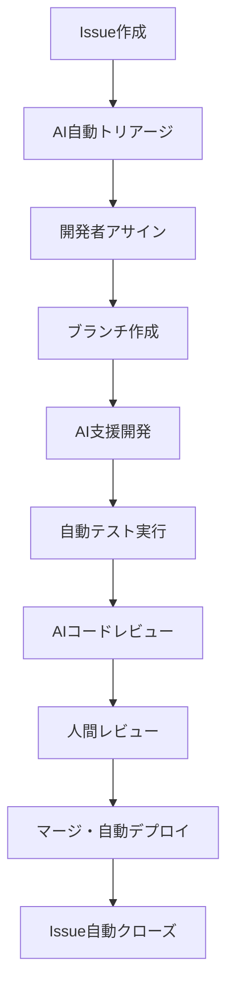

# Development Guide Repository - CLAUDE.md

## プロジェクト概要

このリポジトリは「GitHub IssueドリブンなAI駆動開発のガイドラインおよびセットアップツール」を提供します。

### 目的
- AI駆動開発のベストプラクティス文書化
- Gemini CLI GitHub Actions統合による自動化ワークフロー
- Claude Codeとの協働開発環境構築
- Issue管理からデプロイまでの統合開発フローの標準化

## 主要機能

### 1. AI駆動開発フロー
- **自動Issue分類**: Gemini AIによる新規Issue自動トリアージ
- **AI支援実装**: Claude Codeを使用した高品質コード生成
- **自動品質保証**: AIコードレビューとセキュリティスキャン
- **統合テスト環境**: dev.shスクリプトによる標準化された開発環境

### 2. GitHub Actions統合システム

#### ワークフロー一覧
- **💬 Gemini CLI** (`gemini-cli.yml`): 汎用AI開発支援
- **🧐 PR Review** (`gemini-pr-review.yml`): 自動コードレビュー
- **🏷️ Issue Triage** (`gemini-issue-automated-triage.yml`): リアルタイムIssue分類
- **📋 Scheduled Triage** (`gemini-issue-scheduled-triage.yml`): 定期Issue整理

#### 使用方法
```markdown
# Issue修正依頼
@gemini-cli この認証エラーを調査して修正してください

# PRレビュー依頼
@gemini-cli /review セキュリティに重点を置いてレビューしてください

# Issue分類依頼
@gemini-cli /triage
```

### 3. 開発環境構築（dev.sh）

統合開発支援スクリプトによる効率的な開発環境管理：

```bash
# 全サービス起動
./dev.sh → 選択肢「1」: 🚀 Start All

# 個別サービス起動
./dev.sh → 選択肢「8-10」: Backend/MyPage/CRM個別起動

# テスト実行
./dev.sh → 選択肢「16-19」: 統合テスト
./dev.sh → 選択肢「22-24」: CI環境シミュレーション
```

## 技術スタック

### AI/ML統合
- **Gemini AI**: Issue分類・コードレビュー・開発支援
- **Claude Code**: コード生成・リファクタリング・品質保証

### 開発環境
- **GitHub Actions**: CI/CD自動化
- **Docker**: 本番環境シミュレーション
- **dev.sh**: 統合開発環境スクリプト

### 対象プロジェクト
- **Backend**: NestJS API (Port 8120)
- **Frontend**: React MyPage (Port 8122)
- **Admin**: Angular CRM (Port 8121)
- **Database**: MySQL (Port 3809)

## 開発フロー

### 1. 標準開発サイクル


### 2. ブランチ戦略
```
main
├── feature/issue-123-new-feature
├── bugfix/issue-124-auth-error
├── hotfix/issue-125-critical-bug
└── docs/issue-126-documentation
```

### 3. コミット規約
```
#<issue番号> <種別>: <要約>

<詳細説明>

Closes #<issue番号>
```

## 品質保証

### 自動化されたチェック項目
- **コード品質**: ESLint、Prettier、TypeScript
- **セキュリティ**: 脆弱性スキャン、機密情報検出
- **テスト**: 単体、統合、E2Eテスト
- **パフォーマンス**: 負荷テスト、メモリリーク検出

### CI/CD パイプライン
- **自動ビルド**: 全環境対応（dev/stg/prod）
- **テスト実行**: 並列実行による高速化
- **デプロイ**: 自動通知とロールバック機能

## セットアップ

### 前提条件
- GitHub App設定（権限: Read/Write to Issues, PRs, Actions）
- Gemini API Key
- Google Cloud Project（Workload Identity連携）

### 環境変数
```yaml
secrets:
  GEMINI_API_KEY: "Google Gemini APIキー"
  APP_PRIVATE_KEY: "GitHub Appプライベートキー"

vars:
  APP_ID: "GitHub App ID"
  GCP_WIF_PROVIDER: "Workload Identity Provider"
  GOOGLE_CLOUD_PROJECT: "GCPプロジェクトID"
```

### 初期設定手順
1. リポジトリフォーク/クローン
2. GitHub Actions secrets/variables設定
3. `.github/workflows/` 下のYAMLファイルを環境に合わせて調整
4. `dev.sh` スクリプトをプロジェクト構成に合わせてカスタマイズ

## 利用効果

### 開発効率向上
- **環境構築時間**: 30分 → 2分（93%短縮）
- **Issue解決速度**: 30分 → 5分（83%短縮）
- **コードレビュー時間**: 60分 → 10分（83%短縮）

### 品質向上
- **バグ発見率**: 70% → 95%（36%向上）
- **セキュリティ脆弱性**: 早期発見・自動修正提案
- **コード一貫性**: プロジェクト全体での統一

## Claude Code での作業時推奨手順

1. **プロジェクト理解**
   ```bash
   # プロジェクト構造確認
   ./dev.sh → 選択肢確認
   
   # 依存関係理解
   cat package.json  # またはrequirements.txt等
   ```

2. **開発環境起動**
   ```bash
   # 統合環境起動
   ./dev.sh → 選択肢「1」
   ```

3. **品質チェック実行**
   ```bash
   # Lint・Format
   ./dev.sh → 選択肢「25」
   
   # TypeScript型チェック
   ./dev.sh → 選択肢「26」
   
   # 高速CI環境テスト
   ./dev.sh → 選択肢「23」
   ```

4. **AI協働開発**
   - GitHub IssueでGemini CLI活用（`@gemini-cli`メンション）
   - Claude Codeによるコード実装・リファクタリング
   - 自動PRレビュー結果の反映

## トラブルシューティング

### ポート競合
```bash
# ポート使用プロセス確認・停止
lsof -ti:8120 | xargs kill -9  # Backend
lsof -ti:8121 | xargs kill -9  # CRM Admin
lsof -ti:8122 | xargs kill -9  # MyPage

# dev.sh一括停止
./dev.sh → 選択肢「2」
```

### GitHub Actions権限エラー
- リポジトリ設定でGitHub App権限確認
- Workload Identity連携設定確認
- Secrets/Variables設定確認

## 関連ドキュメント

- **sample-development-guide.md**: 詳細な開発ガイドライン
- **GitHub Actions Workflows**: `.github/workflows/` ディレクトリ
- **開発環境スクリプト**: `dev.sh` （カスタマイズ要）

---

**このリポジトリは、人間とAIが協働する次世代開発環境の実現により、開発効率・品質・体験の全てで最高水準を目指しています。**