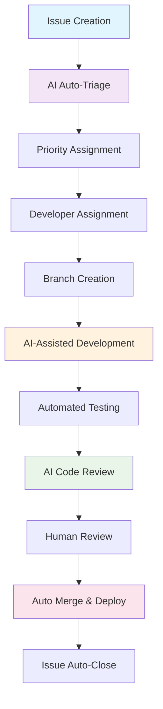

# AI-Driven Development Guide 🤖

[](https://github.com/upbond/development-guide/stargazers)
[](https://github.com/upbond/development-guide/issues)
[](https://github.com/upbond/development-guide/blob/main/LICENSE)
[](https://github.com/upbond/development-guide/actions)

> **GitHub Issue-driven AI Development Guidelines and Setup Tools**  
> Complete framework for implementing AI-driven development workflows with automated issue management, code review, and deployment.

## 🎯 Overview

This repository provides a comprehensive guide and toolset for implementing **AI-driven development workflows** that revolutionize how teams build software. By integrating AI tools like Claude Code and Gemini CLI with GitHub Actions, teams can achieve unprecedented development efficiency and code quality.

### Key Benefits

- **🚀 93% faster environment setup** (30 min → 2 min)
- **⚡ 83% faster issue resolution** (30 min → 5 min)  
- **🔍 36% higher bug detection rate** (70% → 95%)
- **🤖 Fully automated code review and deployment**

## 🌟 Features

### 1. AI-Powered Development Workflow



### 2. Integrated AI Tools

| Tool | Purpose | Automation Level |
|------|---------|------------------|
| **🤖 Gemini CLI** | Issue triage, code review, development assistance | Fully Automated |
| **💻 Claude Code** | Code generation, refactoring, quality assurance | Developer-Assisted |
| **🔧 dev.sh** | Environment setup, testing, deployment | One-Command |
| **📊 GitHub Actions** | CI/CD, notifications, integrations | Fully Automated |

### 3. GitHub Actions Workflows

#### Core Workflows
- **💬 Gemini CLI** (`gemini-cli.yml`) - General AI development support
- **🧐 PR Review** (`gemini-pr-review.yml`) - Automated code review
- **🏷️ Issue Triage** (`gemini-issue-automated-triage.yml`) - Real-time issue classification
- **📋 Scheduled Triage** (`gemini-issue-scheduled-triage.yml`) - Periodic issue management

## 🚀 Quick Start

### 1. Clone and Setup

```bash
# Clone the repository
git clone https://github.com/upbond/development-guide.git
cd development-guide

# Make dev.sh executable (if present)
chmod +x dev.sh

# Start integrated development environment
./dev.sh
```

### 2. AI-Powered Issue Management

```markdown
# In any GitHub issue or PR, mention:

@gemini-cli investigate and fix this authentication error
@gemini-cli /review focus on security and performance
@gemini-cli /triage classify this issue
```

### 3. Development Environment

The `dev.sh` script provides a standardized development environment:

```bash
./dev.sh
# Choose option 1: 🚀 Start All Services
# → Backend API: http://localhost:8120
# → Admin Panel: http://localhost:8121  
# → Frontend: http://localhost:8122
# → Database: localhost:3809
```

## 📚 Documentation

### Core Documents
- **[Development Guide](docs/technical/sample-development-guide.md)** - Complete implementation guide
- **[Business Guide](docs/business/business-development-collaboration-guide.md)** - Business stakeholder guide
- **[OpenAI Integration Guide](docs/integration/openai-integration-guide.md)** - ChatGPT/Copilot integration
- **[Claude Code Setup](CLAUDE.md)** - AI assistant configuration
- **[Contributing Guidelines](CONTRIBUTING.md)** - How to contribute
- **[Issue Templates](.github/ISSUE_TEMPLATE/)** - Standardized issue reporting

### Architecture Diagrams

#### AI Integration Architecture

```mermaid
graph LR
    subgraph "Issue Management"
        I1[New Issue]
        I2[Gemini AI Triage]
        I3[Auto Classification]
    end
    
    subgraph "Development Process"
        D1[Claude Code Development]
        D2[dev.sh Integration]
        D3[Automated Testing]
    end
    
    subgraph "Quality Assurance"
        Q1[AI Code Review]
        Q2[Security Scanning]
        Q3[Performance Analysis]
    end
    
    subgraph "Deployment Pipeline"
        P1[CI/CD Automation]
        P2[Monitoring & Alerts]
        P3[Auto Rollback]
    end
    
    I1 --> I2 --> I3 --> D1
    D1 --> D2 --> D3 --> Q1
    Q1 --> Q2 --> Q3 --> P1
    P1 --> P2 --> P3
```


## 🛠 Setup Requirements

### Prerequisites
- **GitHub Repository** with Actions enabled
- **Google Cloud Project** for Gemini AI integration
- **GitHub App** with appropriate permissions

### Environment Variables

```yaml
# Required Secrets
secrets:
  GEMINI_API_KEY: "Your Google Gemini API Key"
  APP_PRIVATE_KEY: "GitHub App Private Key"

# Required Variables  
vars:
  APP_ID: "GitHub App ID"
  GCP_WIF_PROVIDER: "Workload Identity Provider"
  GOOGLE_CLOUD_PROJECT: "GCP Project ID"
  SERVICE_ACCOUNT_EMAIL: "Service Account Email"
```

### GitHub App Permissions
- **Repository**: Read & Write
- **Issues**: Read & Write
- **Pull Requests**: Read & Write
- **Actions**: Read & Write
- **Metadata**: Read

## 💡 Usage Examples

### Scenario 1: Bug Fix with AI Assistance

```markdown
# 1. Create issue with description
Title: Authentication fails on user login

# 2. AI automatically triages and labels
Labels: [bug, priority/high, area/backend]

# 3. Request AI investigation  
@gemini-cli analyze this authentication error and propose a fix

# 4. AI provides analysis and implementation
→ Creates PR with fix
→ Runs automated tests
→ Requests human review
```

### Scenario 2: Feature Development

```markdown
# 1. Feature request issue
@gemini-cli implement a user dashboard with the following requirements:
- User profile management
- Activity history
- Settings panel

# 2. AI breaks down into tasks
→ Creates development plan
→ Implements backend APIs
→ Creates frontend components
→ Adds comprehensive tests
```

## 📊 Performance Metrics

### Development Efficiency Gains
| Metric | Before | After | Improvement |
|--------|--------|-------|-------------|
| **Environment Setup** | 30 min | 2 min | 93% faster |
| **Issue Resolution** | 30 min | 5 min | 83% faster |  
| **Code Review** | 60 min | 10 min | 83% faster |
| **Bug Detection** | 70% | 95% | 36% higher |

### Quality Improvements
- **Security Vulnerabilities**: Early detection and auto-fix suggestions
- **Code Consistency**: Project-wide standardization
- **Test Coverage**: AI-generated comprehensive test suites
- **Performance**: Automated optimization recommendations

## 🤝 Contributing

We welcome contributions! This project showcases AI-driven development practices, and your improvements help the entire community.

### How to Contribute
1. **Fork** the repository
2. **Create** a feature branch (`git checkout -b feature/amazing-improvement`)
3. **Make** your changes following our AI-driven workflow
4. **Test** using `dev.sh` automation tools
5. **Submit** a Pull Request

See [CONTRIBUTING.md](CONTRIBUTING.md) for detailed guidelines.

### Community Guidelines
- 🤖 Use AI tools (Claude Code, Gemini CLI) for development when possible
- 📝 Follow the standardized issue and PR templates
- ✅ Run automated quality checks before submission
- 🧪 Include comprehensive tests for new features

## 🔗 Related Projects

- **[Claude Code](https://claude.ai/code)** - AI-powered coding assistant
- **[Gemini AI](https://deepmind.google/technologies/gemini/)** - Google's multimodal AI model
- **[GitHub Actions](https://github.com/features/actions)** - CI/CD and automation

## 📄 License

This project is licensed under the **MIT License** - see the [LICENSE](LICENSE) file for details.

## 🏢 About Upbond

This development guide is maintained by **Upbond**, showcasing next-generation AI-driven development practices. We believe in the power of human-AI collaboration to build better software, faster.

- 🌐 **Website**: [upbond.io](https://upbond.io)
- 📧 **Contact**: development-guide@upbond.io
- 🐦 **Twitter**: [@upbond](https://twitter.com/upbond)

## ⭐ Star History

[](https://star-history.com/#upbond/development-guide&Date)

---

**Ready to revolutionize your development workflow? [Get started](https://github.com/upbond/development-guide/issues/new/choose) by creating your first AI-assisted issue!** 🚀

---

<details>
<summary>📈 Advanced Configuration</summary>

### Custom AI Model Configuration

```yaml
# .github/workflows/gemini-cli.yml
env:
  GEMINI_MODEL: "gemini-1.5-pro"  
  MAX_TOKENS: 8192
  TEMPERATURE: 0.1
```

### Development Environment Customization

```bash
# dev.sh configuration
export BACKEND_PORT=8120
export FRONTEND_PORT=8122
export DB_PORT=3809
export API_DOCS_PATH="/api"
```

### CI/CD Pipeline Customization

```yaml
# Custom test patterns
test_patterns:
  - "**/*.test.js"
  - "**/*.spec.ts"
  - "**/*.e2e.js"

# Coverage thresholds
coverage:
  branches: 80
  functions: 85
  lines: 90
```

</details>