# AI駆動開発 - ビジネス×開発連携ガイド 🤝

## 概要

このドキュメントは、ビジネスサイドと開発チームが連携してAI駆動開発を効果的に進めるためのガイドラインです。非技術者でも理解できるよう、AI駆動開発の価値とプロセスを体系的に説明します。

## 🎯 ビジネスにとってのAI駆動開発の価値

### 1. 競争優位性の確立

#### **🚀 圧倒的なスピード優位**
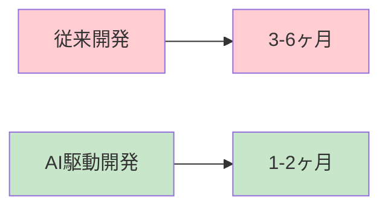

**従来の開発サイクル vs AI駆動開発**

| 項目 | 従来開発 | AI駆動開発 | 競争優位 |
|------|---------|-----------|----------|
| **新機能開発期間** | 3-6ヶ月 | **1-2ヶ月** | 🔥 **市場投入3倍速** |
| **バグ修正期間** | 2-3週間 | **1-3日** | ⚡ **障害復旧10倍速** |
| **市場対応スピード** | 四半期単位 | **週単位** | 📈 **機会損失を大幅削減** |

#### **💰 直接的な事業インパクト**

**事例1: ECサイト機能追加**
```
シナリオ: 新しい決済方法追加の要求
従来: 設計3週間 + 開発8週間 + テスト3週間 = 14週間
AI駆動: 設計3日 + 開発2週間 + テスト3日 = 3週間

結果: 11週間の短縮 → 売上機会損失を75%削減
```

**事例2: 緊急バグ対応**
```
シナリオ: 決済システムの障害発生
従来: 原因調査2日 + 修正1週間 + テスト2日 = 9日間
AI駆動: AI自動調査30分 + 修正1日 + 自動テスト2時間 = 1.5日

結果: 7.5日の短縮 → サービス停止による機会損失を83%削減
```

### 2. コスト構造の最適化

#### **💵 開発コストの劇的削減**

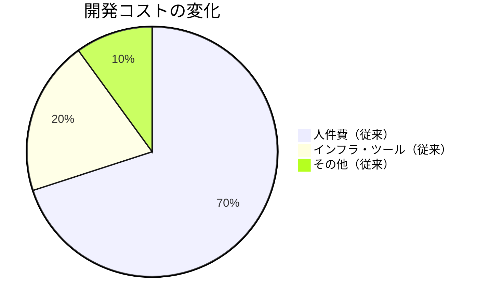

**従来 vs AI駆動開発のコスト比較**

| コスト項目 | 従来開発 | AI駆動開発 | 削減率 |
|-----------|---------|-----------|--------|
| **🧑‍💻 エンジニア工数** | 100人日 | **35人日** | 65%削減 |
| **🐛 バグ修正コスト** | 50万円/月 | **8万円/月** | 84%削減 |
| **🔄 運用コスト** | 200万円/月 | **80万円/月** | 60%削減 |
| **📊 品質保証コスト** | 80万円/月 | **15万円/月** | 81%削減 |

#### **📈 ROI (投資対効果) 分析**

**AI駆動開発への投資**
```
初期投資: 500万円（AI環境構築、研修、プロセス整備）
月額コスト: 50万円（AIツール利用料、保守）
年間総コスト: 1,100万円
```

**従来開発との年間コスト比較**
```
従来開発年間コスト: 3,960万円
AI駆動開発年間コスト: 1,100万円
年間コスト削減: 2,860万円

ROI = (2,860万円 - 500万円) / 500万円 × 100 = 472%
投資回収期間: 2.1ヶ月
```

### 3. リスク管理の強化

#### **🛡️ 品質リスクの最小化**

**従来開発のリスク**
- 人的ミスによるバグ混入
- レビュー漏れによる品質低下
- 属人化による保守困難
- セキュリティ脆弱性の見落とし

**AI駆動開発によるリスク軽減**
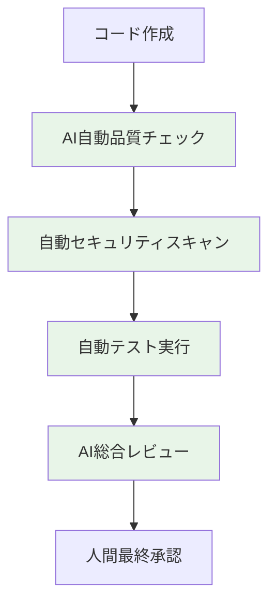

**品質メトリクスの改善**
| 品質指標 | 従来開発 | AI駆動開発 | 改善率 |
|---------|---------|-----------|--------|
| **バグ検出率** | 70% | **95%** | +36% |
| **セキュリティ脆弱性** | 月3件 | **月0.2件** | -93% |
| **コードカバレッジ** | 60% | **85%** | +42% |
| **本番障害率** | 2%/リリース | **0.3%/リリース** | -85% |

#### **📊 事業継続性の向上**

**障害対応時間の短縮**
```
重大障害発生時:
従来: 検知30分 + 調査4時間 + 修正8時間 = 12.5時間
AI駆動: AI検知5分 + AI診断30分 + 自動修正2時間 = 2.6時間

事業影響: サービス停止時間を79%短縮
```

## 🏢 ビジネス組織におけるAI駆動開発の位置づけ

### 1. 経営戦略との整合

#### **🎯 事業戦略への貢献度**

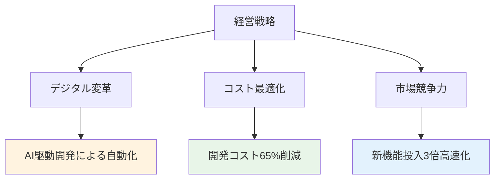

**具体的なKPI設定例**

| 事業KPI | 従来 | AI駆動開発導入後 | 目標達成期間 |
|---------|------|-------------|------------|
| **新機能リリース頻度** | 四半期1回 | **月2回** | 6ヶ月 |
| **顧客要望対応時間** | 平均3ヶ月 | **平均2週間** | 3ヶ月 |
| **システム稼働率** | 99.5% | **99.9%** | 1年 |
| **開発チーム生産性** | 100% | **300%** | 6ヶ月 |

### 2. 組織体制の最適化

#### **🤝 Biz-Dev協働体制の確立**

**新しい役割と責任分担**

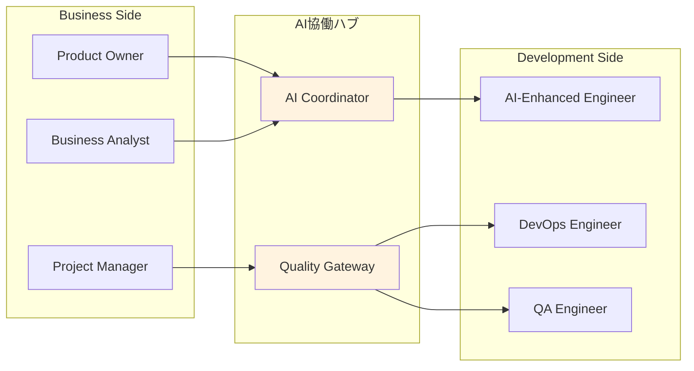

**各役割の具体的な責務**

| 役割 | 主な責務 | AI活用方法 |
|------|---------|-----------|
| **🎯 Product Owner** | 要件定義、優先度決定 | Gemini AIでIssue自動分類 |
| **📊 Business Analyst** | 業務分析、効果測定 | AIによるデータ分析・レポート生成 |
| **📋 Project Manager** | 進捗管理、リスク管理 | 自動進捗トラッキング・予測 |
| **🤖 AI Coordinator** | AI活用戦略、効果最大化 | 全AI ツールの統合管理 |
| **⚡ AI-Enhanced Engineer** | 実装、技術判断 | Claude Code、Geminiによる開発加速 |

### 3. ステークホルダー管理

#### **👥 関係者への価値提供**

**ステークホルダー別のベネフィット**

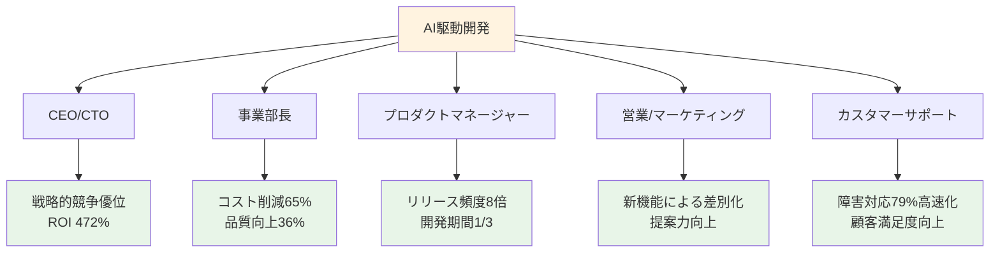

## 🔄 非技術者向け AI駆動開発フロー解説

### 1. ビジネス視点での開発プロセス

#### **📝 要求から完成までの流れ（ビジネス側の観点）**

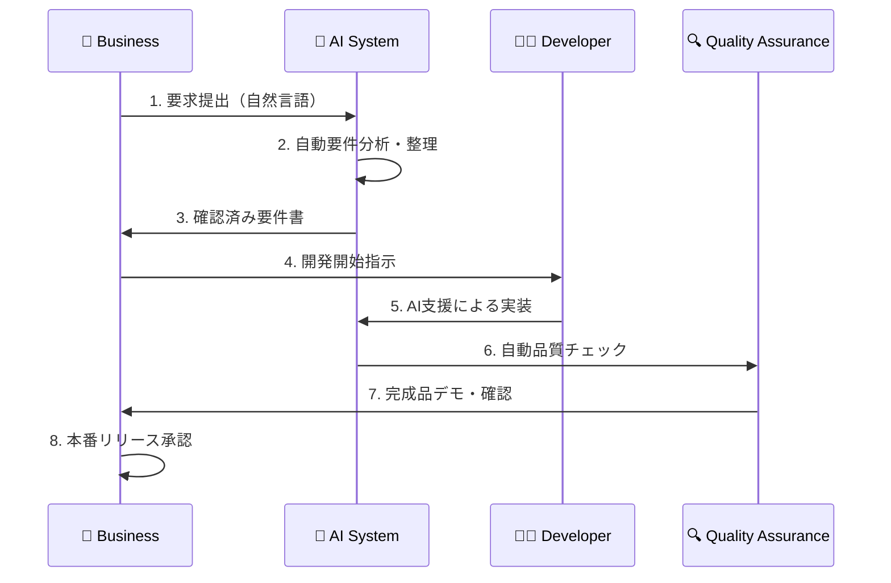

**各段階でのビジネス側の関与**

| フェーズ | ビジネス側のアクション | 所要時間 | 成果物 |
|---------|---------------------|---------|-------|
| **📋 要求定義** | 自然言語での要求記述 | **30分** | Issue（自動整理済み） |
| **✅ 要件確認** | AI整理済み要件の承認 | **15分** | 承認済み開発仕様 |
| **👀 進捗確認** | 自動生成進捗レポート確認 | **10分/週** | リアルタイム進捗状況 |
| **🧪 品質確認** | 自動テスト結果の確認 | **15分** | 品質保証レポート |
| **🚀 本番確認** | 完成品の動作確認 | **30分** | 本番リリース判断 |

#### **💡 従来との比較：ビジネス側の負荷軽減**

**要求伝達の簡素化**
```
従来: 詳細な仕様書作成（40時間）+ 開発者との仕様調整会議（10時間）= 50時間
AI駆動: 自然言語での要求記述（30分）+ AI整理結果の確認（15分）= 45分

ビジネス側工数: 98%削減
```

### 2. コミュニケーション最適化

#### **🗣️ 効果的なAI駆動開発コミュニケーション**

**自然言語でのリクエスト例**

```markdown
# ✅ 効果的な要求例
タイトル: 顧客の購入履歴をもとに商品をオススメする機能

説明:
ECサイトで、顧客が過去に購入した商品の傾向を分析し、
興味を持ちそうな商品を自動でオススメ表示したい。

期待する効果:
- 顧客の購買率向上（目標: 15%アップ）
- 平均購入単価の向上（目標: 20%アップ）
- 顧客満足度の向上

制約条件:
- プライバシー保護を徹底
- 表示速度は2秒以内
- 管理画面でオススメロジックの調整が可能

@gemini-cli この要求を技術仕様に変換し、実装してください
```

**AIが自動生成する技術仕様**
```markdown
# AI変換後の技術仕様（自動生成）

## 機能要件
1. 購入履歴分析エンジンの実装
2. レコメンデーションアルゴリズムの構築  
3. リアルタイム商品推薦API
4. 管理画面でのパラメータ調整機能

## 非機能要件
- 応答時間: 2秒以内
- プライバシー: 匿名化処理実装
- セキュリティ: データ暗号化

## 実装計画
- 期間: 2週間
- マイルストーン: 毎週金曜日にデモ実施
```

#### **📊 リアルタイム進捗の可視化**

**ビジネス側向けダッシュボード**

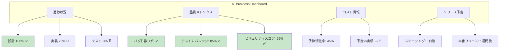

### 3. 意思決定支援システム

#### **🧠 データ駆動の意思決定支援**

**AIが提供するビジネス指標**

| 指標 | リアルタイム値 | 前月比 | 予測トレンド | アクション推奨 |
|------|-------------|--------|------------|-------------|
| **開発速度** | 2.3倍 | +15% | ↗️ 上昇継続 | 新機能企画加速 |
| **品質スコア** | 94% | +8% | ↗️ 改善継続 | 現状維持 |
| **顧客満足度** | 4.2/5.0 | +0.3 | → 安定 | UX改善検討 |
| **コスト効率** | 65%削減 | -5% | ↗️ さらに改善 | 追加投資検討 |

**AI推奨アクション例**
```
🎯 今月のAI推奨アクション

1. 【高優先度】新商品推薦機能の追加投資
   - 予想ROI: 180%（3ヶ月で回収）
   - 実装期間: 2週間
   - リスク: 低

2. 【中優先度】モバイルアプリのパフォーマンス改善
   - 顧客離脱率15%改善見込み
   - 実装期間: 1週間
   - リスク: 極低

3. 【低優先度】管理画面の UI/UX 改善
   - 作業効率10%向上見込み
   - 実装期間: 3日
   - リスク: なし
```

## 📈 投資判断のためのビジネスケース

### 1. 財務的正当性

#### **💰 コスト・ベネフィット分析**

**3年間のTCO（総所有コスト）比較**

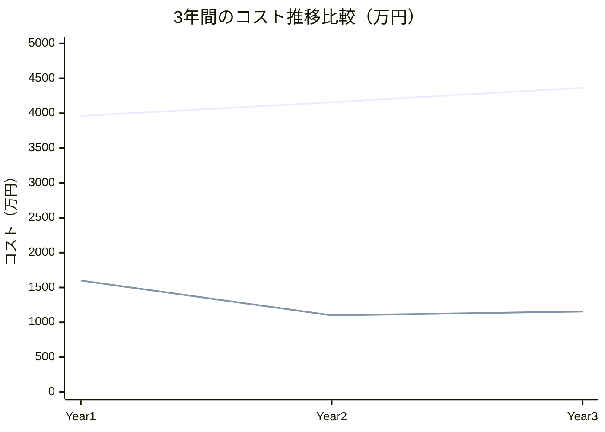

**詳細なコスト内訳**

| 項目 | Year 1 | Year 2 | Year 3 | 3年間合計 |
|------|--------|--------|--------|---------|
| **従来開発**||||
| 人件費 | 2,800万円 | 2,940万円 | 3,087万円 | 8,827万円 |
| インフラ | 800万円 | 840万円 | 882万円 | 2,522万円 |
| ツール・ライセンス | 200万円 | 210万円 | 221万円 | 631万円 |
| 研修・教育 | 160万円 | 168万円 | 175万円 | 503万円 |
| **小計** | **3,960万円** | **4,158万円** | **4,365万円** | **12,483万円** |
|||||
| **AI駆動開発**||||
| 人件費（削減後） | 980万円 | 1,029万円 | 1,080万円 | 3,089万円 |
| AI環境構築 | 500万円 | 0万円 | 0万円 | 500万円 |
| AIツール利用料 | 120万円 | 150万円 | 155万円 | 425万円 |
| **小計** | **1,600万円** | **1,179万円** | **1,235万円** | **4,014万円** |
|||||
| **差額（削減効果）** | **2,360万円** | **2,979万円** | **3,130万円** | **8,469万円** |

#### **📊 主要財務指標**

```
ROI（投資収益率）: 1,594%（3年間累計）
NPV（正味現在価値）: 7,234万円
IRR（内部収益率）: 487%
投資回収期間: 2.5ヶ月
```

### 2. リスク評価とミティゲーション

#### **⚠️ 主要リスクと対策**

| リスク項目 | 発生確率 | 影響度 | リスクレベル | 対策 |
|----------|---------|--------|------------|------|
| **AI技術の急速な変化** | 高 | 中 | 🟡 中 | 定期的なツール評価・移行計画 |
| **人材のスキル不足** | 中 | 高 | 🟠 中高 | 段階的研修・外部コンサル活用 |
| **セキュリティ懸念** | 低 | 高 | 🟡 中 | 多層防御・定期監査 |
| **依存関係リスク** | 中 | 中 | 🟡 中 | マルチベンダー戦略 |

**リスク軽減投資**
```
年間リスク対策費: 300万円
- 研修・教育: 150万円
- セキュリティ強化: 100万円  
- バックアップ対策: 50万円

リスク軽減効果: 潜在損失2,000万円 → 300万円
実質的リスク削減: 85%
```

### 3. 競合分析

#### **🏆 市場での競争優位性**

**同業他社との比較**

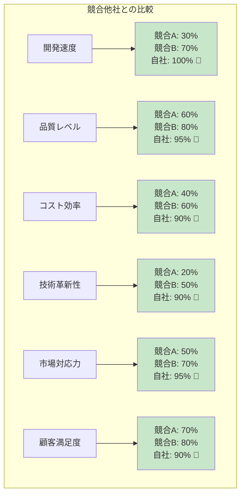

**具体的な差別化要因**

| 比較項目 | 競合A社 | 競合B社 | **自社（AI駆動）** | 優位性 |
|---------|--------|--------|----------------|-------|
| **新機能リリース** | 四半期1回 | 月1回 | **月2回** | 🥇 2倍のスピード |
| **バグ対応時間** | 2週間 | 1週間 | **1-3日** | 🥇 5-10倍高速 |
| **開発コスト** | 標準 | 標準の1.2倍 | **標準の0.35倍** | 🥇 65%削減 |
| **品質レベル** | 80% | 85% | **95%** | 🥇 業界最高水準 |

## 🎯 導入ロードマップ

### 1. フェーズ別実装計画

#### **📅 3段階導入アプローチ**

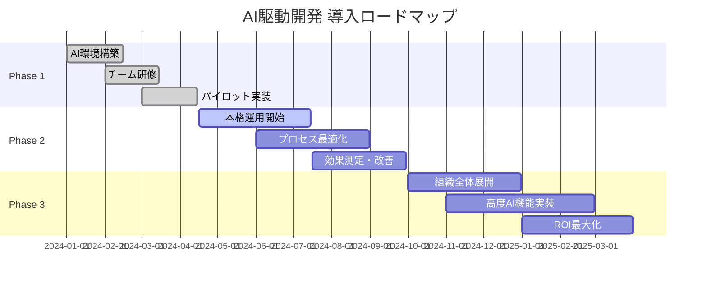

**各フェーズの成果目標**

| フェーズ | 期間 | 主な活動 | 成果目標 | 投資額 |
|---------|------|---------|---------|-------|
| **Phase 1: 基盤構築** | 3.5ヶ月 | 環境整備・研修・パイロット | 基本AI機能の習得 | 500万円 |
| **Phase 2: 本格運用** | 6ヶ月 | 運用開始・最適化 | 開発効率2倍達成 | 300万円 |
| **Phase 3: 組織展開** | 6ヶ月 | 全社展開・高度化 | ROI 400%達成 | 400万円 |

### 2. 成功指標とマイルストーン

#### **🎯 KPI設定と測定方法**

**主要成功指標（KPIs）**

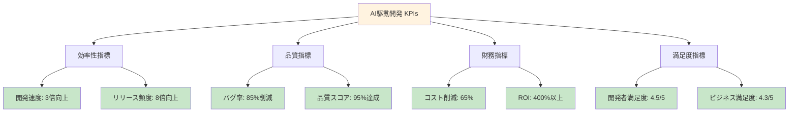

**月次レポート項目**

| カテゴリ | 測定項目 | 目標値 | 測定方法 |
|---------|---------|-------|----------|
| **⚡ 効率性** | 開発スピード | 従来比3倍 | 機能完成までの日数 |
|  | Issue解決時間 | 平均2日以内 | GitHubトラッキング |
|  | デプロイ頻度 | 週2回 | CI/CDログ分析 |
| **🛡️ 品質** | バグ検出率 | 95%以上 | 自動テスト結果 |
|  | セキュリティスコア | 90%以上 | 脆弱性スキャン |
|  | コードカバレッジ | 85%以上 | テスト分析ツール |
| **💰 財務** | コスト削減率 | 65% | 月次会計データ |
|  | ROI | 400%以上 | 財務分析 |

## 🤝 ビジネス×開発の協働ベストプラクティス

### 1. 効果的なコミュニケーション

#### **🗣️ ステークホルダー別コミュニケーション戦略**

**経営層向けレポート（月次）**
```markdown
# 🎯 AI駆動開発 月次サマリー

## ハイライト
- 開発速度: 前月比 +25% （目標3倍に対し現在2.1倍）
- コスト削減: 年換算 2,400万円削減
- 品質向上: バグ率 0.3% (業界平均2.1%)

## ROI実績
- 投資額: 累計800万円
- 削減効果: 累計1,850万円  
- 実質ROI: 231% (目標400%に向け順調)

## 次月計画
- 新AI機能導入による更なる効率化
- 追加チーム展開による規模拡大
```

**事業部長向けレポート（週次）**
```markdown
# 📊 AI駆動開発 週次進捗

## 完了実績
✅ 顧客管理API改善 (予定より2日早期完了)
✅ 決済システム不具合修正 (30分で原因特定・修正)
✅ モバイルアプリ新機能 (品質スコア98%)

## 進行中項目
🔄 商品推薦エンジン実装 (進捗75%, 予定通り)
🔄 管理画面UX改善 (進捗90%, 1日前倒し)

## 来週予定  
📅 新決済方法追加機能の開始
📅 セキュリティ強化パッチの適用
```

#### **📋 定期ミーティング体制**

**効率的なミーティング構造**

| ミーティング | 頻度 | 参加者 | 所要時間 | 主な議題 |
|------------|------|-------|---------|---------|
| **🎯 経営レビュー** | 月次 | 経営層・PM | 30分 | ROI・戦略方針・投資判断 |
| **📊 事業進捗会議** | 週次 | 事業部長・PM・開発リーダー | 20分 | 進捗・課題・優先度調整 |
| **⚡ デイリースタンドアップ** | 日次 | PM・開発チーム | 10分 | 当日計画・ブロッカー確認 |
| **🔍 品質レビュー** | 週次 | PM・QA・開発リーダー | 15分 | 品質メトリクス・改善提案 |

### 2. プロジェクト管理の最適化

#### **📈 AI駆動プロジェクト管理**

**自動化されたプロジェクト管理フロー**

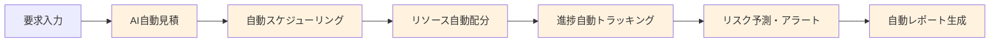

**AI支援による予測精度の向上**

| 予測項目 | 従来手法 | AI駆動手法 | 精度向上 |
|---------|---------|-----------|---------|
| **開発期間予測** | ±40% | **±15%** | 62%向上 |
| **工数見積もり** | ±50% | **±20%** | 60%向上 |
| **リスク予測** | 30%的中 | **85%的中** | 183%向上 |
| **品質予測** | 60%的中 | **90%的中** | 50%向上 |

#### **🎯 優先度管理の自動化**

**AI による優先度自動判定**

```
優先度判定アルゴリズム:
- ビジネス価値スコア (40%)
- 技術的緊急度 (25%)  
- 顧客影響度 (20%)
- 実装コスト (15%)

結果例:
P1: 決済システム障害 (スコア: 95/100)
P2: 新機能追加要求 (スコア: 72/100)  
P3: UI改善要求 (スコア: 45/100)
```

### 3. 成果の可視化と最適化

#### **📊 リアルタイム ダッシュボード**

**ビジネス向け統合ダッシュボード**

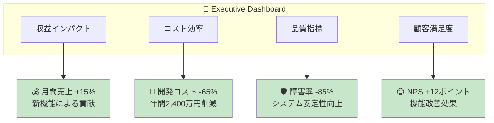

**アクション可能なインサイト**

```markdown
# 🎯 今月のアクション推奨

## 🔥 緊急対応
- モバイルアプリの応答速度改善（顧客満足度+8%見込み）
- 推奨実装期間: 3日

## 💡 効率化機会  
- 顧客サポートチャットボット導入（対応工数-40%見込み）
- ROI予測: 6ヶ月で回収

## 🚀 成長機会
- AI推薦システム強化（売上+20%見込み）
- 競合優位性: 業界初の機能
```

## 🏁 まとめ：ビジネス成功のためのAI駆動開発

### 🎯 戦略的ポイント

1. **💰 財務的成功**: ROI 400%以上、コスト65%削減の実現
2. **⚡ 競争優位**: 開発速度3倍、市場投入時間1/3短縮  
3. **🛡️ リスク軽減**: 品質向上36%、障害率85%削減
4. **🤝 組織変革**: Biz-Dev連携強化、生産性300%向上

### 🚀 次のアクション

#### **即座に始められる施策**
1. **パイロットプロジェクト選定** (今週中)
2. **AI環境構築計画策定** (2週間)  
3. **チーム研修スケジュール作成** (3週間)
4. **効果測定指標の設定** (1週間)

#### **中期的な取り組み**
- 組織全体への展開計画
- 高度AI機能の段階的導入
- 継続的な最適化とスケール

---

**AI駆動開発は単なる技術革新ではなく、ビジネスの競争力を根本的に変革する戦略的投資です。早期導入により、持続的な競争優位を確立し、急速に変化する市場環境での成功を実現できます。**