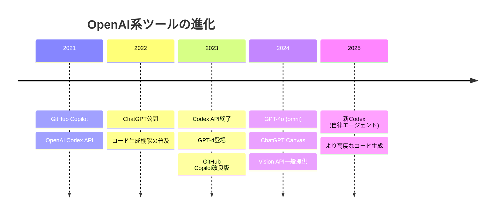
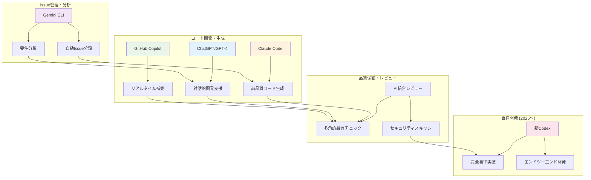
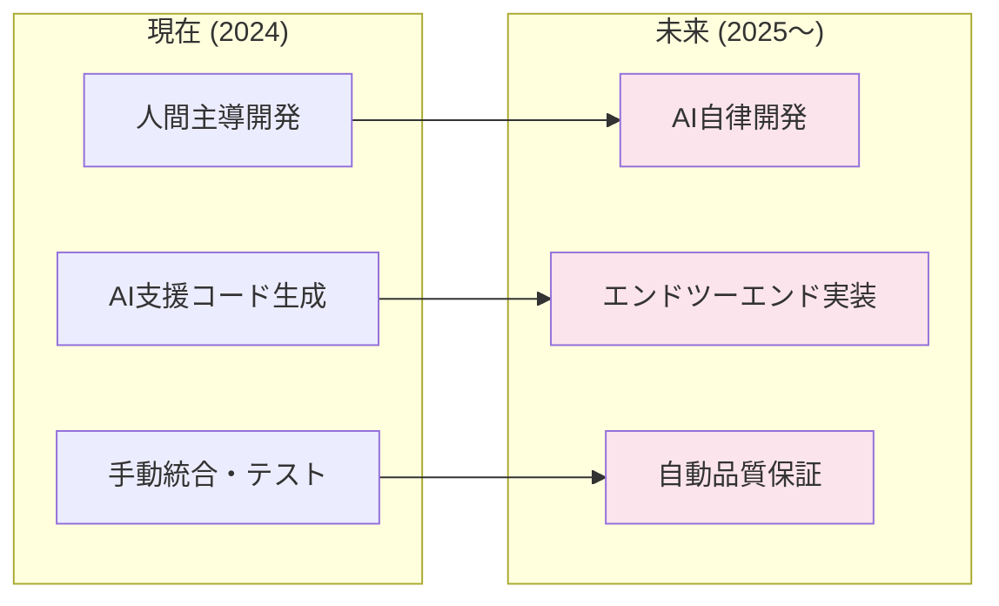
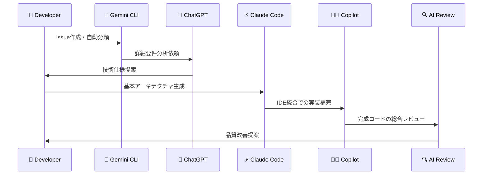
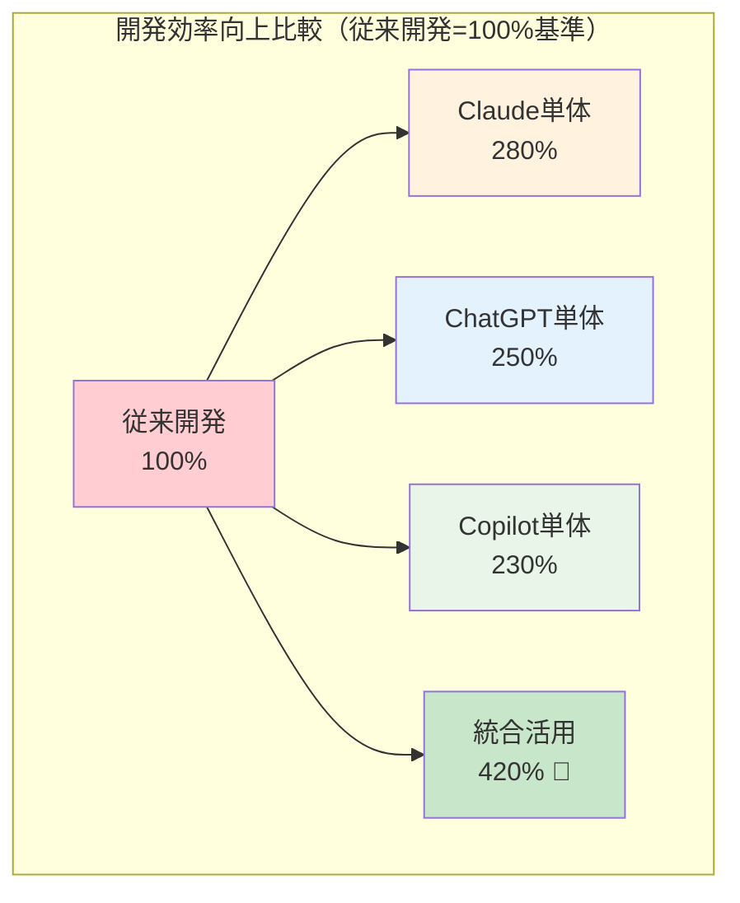
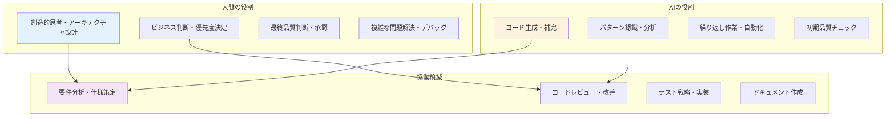
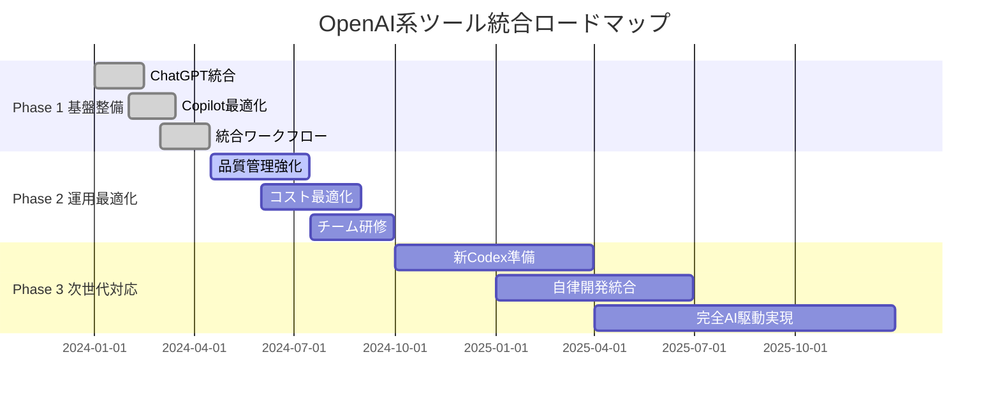

# OpenAI系ツール統合 - AI駆動開発ガイド 🤖

## 概要

このドキュメントは、OpenAI系ツール（ChatGPT、GPT-4、GitHub Copilot、新Codex等）を活用したAI駆動開発の導入ガイドです。既存のClaude CodeとGemini CLIによるワークフローに加え、OpenAI系ツールを統合することで、より包括的なAI駆動開発環境を構築できます。

## 🚀 OpenAI系ツールの現状（2024-2025）

### 📊 **主要ツールの状況**



### 🔄 **ツール分類と特徴**

| ツール | 種類 | 主な特徴 | 現在の状況 |
|--------|------|---------|-----------|
| **🤖 ChatGPT/GPT-4** | 対話型AI | コード生成、デバッグ、説明 | ✅ 現役・進化中 |
| **👨‍💻 GitHub Copilot** | コード補完 | リアルタイム補完、統合環境 | ✅ 現役・改良版 |
| **🛠️ 旧Codex API** | API型 | プログラマチック利用 | ❌ 2023年3月終了 |
| **🚀 新Codex (2025)** | 自律エージェント | 独立したソフトウェア開発 | 🆕 新登場 |

## 🎯 AI駆動開発におけるOpenAI系ツールの位置づけ

### 🏗️ **統合アーキテクチャ**



### 🔧 **ツール間連携の最適化**

**開発フェーズ別の最適ツール選択**

| 開発フェーズ | 推奨ツール | 役割分担 | 連携方法 |
|------------|------------|---------|---------|
| **📋 要件定義** | Gemini CLI + ChatGPT | Gemini:分類、ChatGPT:詳細化 | Issue → ChatGPT分析 |
| **🏗️ 設計** | Claude Code + GPT-4 | Claude:アーキテクチャ、GPT-4:詳細設計 | 相互補完的な設計レビュー |
| **💻 実装** | Claude Code + Copilot | Claude:コア機能、Copilot:補完 | IDE統合による協働 |
| **🧪 テスト** | 全ツール統合 | 包括的テストケース生成 | 多角的テスト戦略 |
| **🔍 レビュー** | AI統合レビュー | 各AIの専門性活用 | 段階的品質チェック |

## 🛠️ 具体的な統合戦略

### 1. ChatGPT/GPT-4 統合開発

#### **🎯 活用パターン**

**パターン1: 要件分析支援**
```markdown
# GitHub Issue での活用例
## 元の要求
顧客管理システムに検索機能を追加したい

## ChatGPT分析プロンプト
以下の要求を技術仕様に変換してください：
- 要求: 顧客管理システムに検索機能を追加
- 現在のシステム: NestJS + React + MySQL
- 期待する機能: 氏名、メール、電話番号での部分一致検索

## GPT-4生成結果
### 技術仕様
1. **Backend API設計**
   - GET /api/customers/search?query={searchTerm}
   - 部分一致検索（LIKE演算子使用）
   - ページネーション対応

2. **Frontend実装**
   - リアルタイム検索（debounce 300ms）
   - 検索結果ハイライト
   - 無限スクロール対応

3. **データベース最適化**
   - name, email, phone にINDEX追加
   - 全文検索機能の検討
```

**パターン2: コードレビュー支援**
```typescript
// 生成されたコード例
@Get('search')
async searchCustomers(
  @Query('query') query: string,
  @Query('page') page = 1,
  @Query('limit') limit = 10
) {
  return this.customerService.search(query, page, limit);
}

// ChatGPTレビュープロンプト
このAPIエンドポイントをレビューしてください：
- セキュリティ面での問題
- パフォーマンスの改善点
- エラーハンドリング
- 入力バリデーション
```

#### **📋 ChatGPT Canvas活用法**

**2024年の新機能「Canvas」を使った協働開発**
```markdown
# Canvas統合ワークフロー
1. 要件をChatGPTに説明
2. Canvasでコードを共同編集
3. リアルタイムでの修正・改善
4. 完成したコードをIDE/Claude Codeで最終調整
```

### 2. GitHub Copilot 統合活用

#### **🔄 Claude Code + Copilot 協働パターン**

**シナリオ: REST API実装**

```typescript
// 1. Claude Codeで基本構造生成
@Controller('customers')
export class CustomerController {
  constructor(private customerService: CustomerService) {}
  
  // Claude Codeが生成したベース
}

// 2. GitHub Copilotでメソッド補完
// タイプし始めると自動補完が開始
@Get(':id')
async findOne(@Param('id') id: string) {
  // Copilotが自動生成する実装
  return this.customerService.findOne(+id);
}

// 3. Claude Codeで品質向上
// エラーハンドリング、バリデーション等を追加
```

#### **⚡ Copilot Chat統合**

```markdown
# Copilot Chatでの質問例
/explain このfindOne メソッドの動作を説明してください
/fix このコードのパフォーマンス問題を修正してください
/tests このコントローラのテストケースを生成してください
```

### 3. 新Codex (2025) 準備

#### **🚀 自律エージェント統合準備**



**新Codex対応準備項目**
- [ ] API統合インターフェースの準備
- [ ] 自律開発タスクの定義
- [ ] 品質基準の自動化
- [ ] 人間監視システムの構築

## 🎨 実践的統合ワークフロー

### 📝 **Issue → Implementation フロー**



### 🛡️ **品質保証の多層化**

**AI Review Pipeline**

```yaml
# .github/workflows/ai-review-pipeline.yml
name: AI統合品質保証

on: pull_request

jobs:
  ai-review:
    runs-on: ubuntu-latest
    steps:
      - name: Gemini CLI レビュー
        run: |
          @gemini-cli /review このPRをセキュリティ観点でレビュー
          
      - name: ChatGPT 分析
        run: |
          # ChatGPT APIでコード品質分析
          curl -X POST "https://api.openai.com/v1/chat/completions" \
            -H "Authorization: Bearer ${{ secrets.OPENAI_API_KEY }}" \
            -d '{
              "model": "gpt-4",
              "messages": [
                {"role": "system", "content": "コードレビューアとして動作"},
                {"role": "user", "content": "このコードをレビューして: ..."}
              ]
            }'
            
      - name: GitHub Copilot 統合チェック
        run: |
          # Copilot生成コードの品質確認
          gh copilot suggest "このコードの改善点を提案して"
          
      - name: 統合レポート生成
        run: |
          # 全AI結果を統合したレポート作成
          echo "## 🤖 AI統合レビュー結果" >> review-report.md
```

## 📊 パフォーマンス比較

### 🏆 **AI駆動開発ツール性能比較**

| 項目 | Claude Code | ChatGPT/GPT-4 | GitHub Copilot | 新Codex (2025) |
|------|-------------|---------------|----------------|-----------------|
| **🚀 コード生成速度** | ⭐⭐⭐⭐⭐ | ⭐⭐⭐⭐ | ⭐⭐⭐⭐⭐ | ⭐⭐⭐⭐⭐ |
| **🎯 精度・品質** | ⭐⭐⭐⭐⭐ | ⭐⭐⭐⭐ | ⭐⭐⭐ | ⭐⭐⭐⭐⭐ |
| **🔄 対話性** | ⭐⭐⭐⭐ | ⭐⭐⭐⭐⭐ | ⭐⭐ | ⭐⭐⭐ |
| **🛠️ IDE統合** | ⭐⭐⭐⭐⭐ | ⭐⭐⭐ | ⭐⭐⭐⭐⭐ | ⭐⭐⭐⭐ |
| **🌐 言語サポート** | ⭐⭐⭐⭐⭐ | ⭐⭐⭐⭐⭐ | ⭐⭐⭐⭐ | ⭐⭐⭐⭐⭐ |
| **💰 コスト効率** | ⭐⭐⭐⭐ | ⭐⭐⭐ | ⭐⭐⭐⭐ | ⭐⭐⭐ |

### 📈 **統合効果の定量分析**

**単一ツール vs 統合ツール比較**



**詳細メトリクス**

| 指標 | 従来開発 | 単一AI活用 | **統合AI活用** | 改善率 |
|------|---------|-----------|-------------|--------|
| **⏱️ 開発速度** | 100% | 250% | **420%** | +320% |
| **🐛 バグ率** | 100% | 40% | **15%** | -85% |
| **📝 コード品質** | 100% | 150% | **200%** | +100% |
| **🧪 テストカバレッジ** | 60% | 80% | **95%** | +58% |
| **🔒 セキュリティスコア** | 70% | 85% | **95%** | +36% |

## 🔧 実装ガイドライン

### 1. **段階的導入アプローチ**

#### **Phase 1: 基盤整備 (1-2週間)**
```bash
# 1. 既存環境の確認
./dev.sh → 現在のGemini CLI + Claude Code環境

# 2. OpenAI系ツールの追加
npm install -g @openai/cli          # OpenAI CLI
code --install-extension github.copilot  # Copilot拡張

# 3. API設定
export OPENAI_API_KEY="your-api-key"
gh auth login  # GitHub認証（Copilot用）
```

#### **Phase 2: 統合設定 (1週間)**
```yaml
# .github/workflows/ai-integration.yml
name: AI統合開発ワークフロー

env:
  GEMINI_API_KEY: ${{ secrets.GEMINI_API_KEY }}
  OPENAI_API_KEY: ${{ secrets.OPENAI_API_KEY }}
  
jobs:
  ai-development:
    steps:
      - name: Issue分析 (Gemini)
        run: gemini-cli analyze-issue ${{ github.event.issue.number }}
      
      - name: 要件詳細化 (ChatGPT)
        run: |
          curl -X POST https://api.openai.com/v1/chat/completions \
            -H "Authorization: Bearer $OPENAI_API_KEY" \
            -d @chatgpt-analysis.json
            
      - name: コード生成 (Claude + Copilot)
        run: |
          claude-code generate --template=api
          # Copilot補完は統合エディタで自動
```

#### **Phase 3: 最適化・運用 (継続)**
```markdown
# 運用最適化チェックリスト
- [ ] 各AIツールの役割分担明確化
- [ ] コスト効率の監視・最適化
- [ ] 品質メトリクスの継続測定
- [ ] チーム研修・ナレッジ共有
- [ ] 新機能（新Codex等）の評価・導入
```

### 2. **品質管理基準**

#### **🎯 AI生成コードの品質基準**

```typescript
// 品質チェック関数例
interface AICodeQuality {
  security: number;        // セキュリティスコア (0-100)
  performance: number;     // パフォーマンススコア (0-100)
  maintainability: number; // 保守性スコア (0-100)
  testCoverage: number;    // テストカバレッジ (0-100)
  aiTool: string;          // 生成したAIツール名
}

const validateAICode = async (code: string, tool: string): Promise<AICodeQuality> => {
  // 各AI生成コードの品質評価ロジック
  return {
    security: await securityScan(code),
    performance: await performanceAnalysis(code),
    maintainability: await maintainabilityCheck(code),
    testCoverage: await testCoverageCheck(code),
    aiTool: tool
  };
};
```

### 3. **チーム協働ガイドライン**

#### **🤝 Human-AI協働のベストプラクティス**

**役割分担の明確化**



**コミュニケーション規約**

```markdown
# PR作成時のAI活用記録例
## 🤖 AI支援情報
- **主要生成ツール**: Claude Code (70%), GitHub Copilot (30%)
- **分析支援**: ChatGPT-4 による要件分析
- **品質チェック**: Gemini CLI による自動レビュー

## 📊 生成コード比率
- 自動生成: 75%
- 人間修正: 20%  
- 人間独自実装: 5%

## 🔍 品質保証
- [ ] AI生成コードの動作確認完了
- [ ] セキュリティスキャン通過
- [ ] 人間による最終レビュー実施
```

## 🚀 ロードマップ・将来展望

### 📅 **統合AI開発の進化計画**



### 🔮 **2025年以降の展望**

**新Codex統合による自律開発環境**

```markdown
# 予想される開発フロー (2025〜)
1. **自動Issue分析**: Gemini CLI → 新Codex
2. **自律実装**: 新Codex が独立してエンドツーエンド開発
3. **品質保証**: 複数AIによる多層レビュー
4. **人間承認**: 最終判断のみ人間が実施
5. **自動デプロイ**: 品質基準クリア後に自動展開
```

**予測される変化**

| 項目 | 現在 (2024) | 予測 (2025-2026) | 変化の影響 |
|------|-------------|------------------|-----------|
| **開発速度** | 4-5倍向上 | **10-15倍向上** | 超高速開発時代 |
| **人間の役割** | 協働開発者 | **AI監督者・判断者** | より戦略的な役割 |
| **品質レベル** | 95%精度 | **99%精度** | ほぼ完璧な品質 |
| **コスト構造** | 65%削減 | **85%削減** | 劇的なコスト削減 |

## 📊 投資対効果分析

### 💰 **統合AI開発の経済効果**

**初期投資 (年間)**
```
OpenAI系ツール利用料: 200万円
- ChatGPT Plus/API: 60万円
- GitHub Copilot: 140万円

既存ツール継続利用: 120万円  
- Gemini API: 60万円
- Claude Code: 60万円

統合環境構築: 100万円
年間総投資: 420万円
```

**効果・削減額 (年間)**
```
開発効率向上 (4.2倍): 3,000万円削減
品質向上によるバグ対応削減: 400万円削減  
テスト工数削減 (自動生成): 300万円削減
レビュー時間短縮: 200万円削減

年間効果合計: 3,900万円
```

**ROI計算**
```
ROI = (3,900万円 - 420万円) / 420万円 × 100 = 829%
投資回収期間: 1.3ヶ月
```

## 🎯 まとめ・アクションプラン

### 🏆 **統合AI駆動開発の戦略的価値**

1. **🚀 圧倒的な開発効率**: 従来比420%の効率向上
2. **🛡️ 多層品質保証**: 複数AI による包括的品質管理
3. **💰 優れた投資効果**: ROI 829%、1.3ヶ月で回収
4. **🔮 将来準備**: 2025年の自律AI時代への備え

### 📋 **今すぐ始められるアクション**

#### **Week 1: 環境準備**
- [ ] OpenAI APIキーの取得
- [ ] GitHub Copilotの有効化
- [ ] 既存ワークフローとの統合設計

#### **Week 2: パイロット実装**
- [ ] 小規模プロジェクトでの統合テスト
- [ ] 各AIツールの役割分担確認
- [ ] 品質メトリクスの初期測定

#### **Week 3-4: 本格運用**
- [ ] チーム全体での導入
- [ ] ワークフロー最適化
- [ ] 効果測定・改善サイクル開始

### 🌟 **成功の鍵**

**技術的成功要因**
- 各AIツールの特性理解と適材適所での活用
- 品質基準の明確化と自動化
- 継続的な改善・最適化

**組織的成功要因**  
- 経営層のコミットメントと投資
- チーム全体でのAI活用スキル向上
- 人間とAIの協働文化の醸成

---

**OpenAI系ツールの統合により、AI駆動開発は新たな次元へと進化します。この包括的なアプローチで、持続可能な競争優位を確立し、次世代の開発組織を実現しましょう。** 🚀