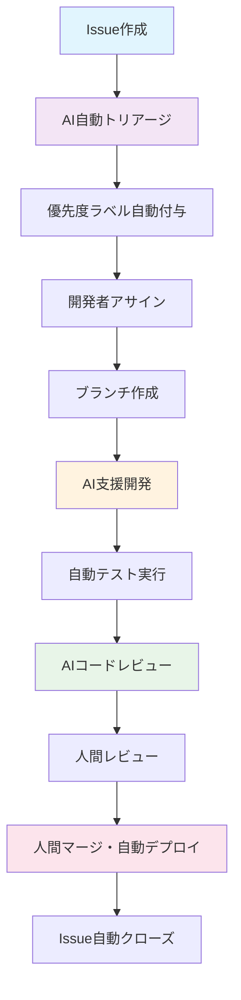
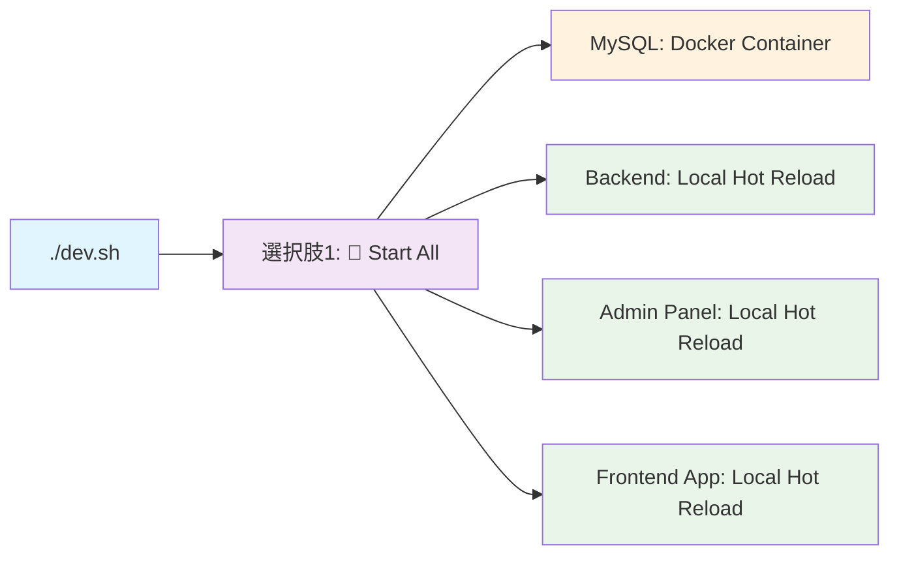

# AI駆動開発ガイド - サンプルプロジェクト

## 概要

このドキュメントは、サンプルプロジェクトにおけるissue駆動開発のガイドラインを提供します。効率的な開発フローとコードの品質維持を目的としています。

## AI駆動Issue開発フロー 🤖

### 1. Issue作成からPRまでの基本フロー



### 2. AI駆動開発の統合アーキテクチャ

```mermaid
graph LR
    subgraph "Issue Management"
        I1[新規Issue]
        I2[Gemini AI Triage]
        I3[自動分類優先度付け]
    end
    
    subgraph "Development Process"
        D1[Claude Code支援開発]
        D2[dev.sh統合開発環境]
        D3[自動テスト生成]
    end
    
    subgraph "Quality Assurance"
        Q1[AI Code Review]
        Q2[自動セキュリティスキャン]
        Q3[パフォーマンス分析]
    end
    
    subgraph "Deployment Pipeline"
        P1[CI/CD Automation]
        P2[監視アラート]
        P3[自動ロールバック]
    end
    
    I1 --> I2
    I2 --> I3
    I3 --> D1
    D1 --> D2
    D2 --> D3
    D3 --> Q1
    Q1 --> Q2
    Q2 --> Q3
    Q3 --> P1
    P1 --> P2
    P2 --> P3
    
    style I2 fill:#f3e5f5
    style D1 fill:#fff3e0
    style Q1 fill:#e8f5e8
```



### 3. AI駆動開発のアピールポイント ✨

#### 🚀 **開発効率の劇的向上**
- **Issue自動トリアージ**: Gemini AIが新規Issueを自動分類・優先度付け
- **コード生成支援**: Claude Codeによる高品質なコード自動生成
- **統合開発環境**: dev.shによる標準化されたワンコマンド開発環境構築

#### 🔍 **品質保証の自動化**
- **AIコードレビュー**: 潜在的なバグ・セキュリティ脆弱性を事前検知
- **自動テスト生成**: AIがエッジケースを含む包括的なテストケースを生成
- **継続的品質監視**: リアルタイムでコード品質メトリクスを追跡

#### 📊 **データ駆動意思決定**
- **開発パフォーマンス可視化**: AI分析による開発チームの生産性insights
- **予測的なリスク管理**: 過去のパターンから潜在的問題を事前予測
- **リソース最適化**: AI推奨による効率的な開発リソース配分

#### 🤖 **継続的学習・改善**
- **フィードバックループ**: AIモデルが開発パターンから学習し精度向上
- **カスタマイズ**: プロジェクト固有のルール・パターンに適応
- **進化する開発支援**: 使用するほど賢くなるインテリジェント開発環境

### 2. Issue作成ガイドライン

#### 必須項目
- **タイトル**: 明確で具体的なタスク内容
- **説明**: 背景、目的、期待される成果
- **ラベル**: 適切な分類（bug, enhancement, documentation等）
- **アサイニー**: 担当者（複数人の場合は明記）
- **マイルストーン**: リリース予定がある場合

#### Issue番号の活用
- ブランチ名: `issue-123-feature-name`
- コミットメッセージ: `#123 コミット内容`
- PR作成時: `Closes #123` を含める

### 3. ブランチ戦略

```
main
├── feature/issue-123-new-customer-api
├── bugfix/issue-124-auth-error  
├── hotfix/issue-125-critical-bug
└── docs/issue-126-api-documentation
```

#### ブランチ命名規則
- **feature/**: 新機能開発
- **bugfix/**: バグ修正
- **hotfix/**: 緊急修正
- **docs/**: ドキュメント更新
- **refactor/**: リファクタリング

### 4. コミットメッセージ規約

```
#<issue番号> <種別>: <要約>

<詳細説明>

Closes #<issue番号>
```

#### 例
```
#123 feat: 顧客情報API新規作成

- 顧客の基本情報取得エンドポイントを追加
- バリデーション機能を実装
- テストケースを追加

Closes #123
```

### 5. 開発環境セットアップ

#### 事前準備
1. リポジトリのクローン
2. 環境変数の設定（`.env.example` を参考）
3. 依存関係のインストール

```bash
# 全体の依存関係インストール
npm install

# 統合開発支援スクリプトによる起動
./dev.sh
```

#### **🤖 AI協働開発を前提とした環境設計**

このサンプルプロジェクトでは、**dev.shをあらかじめ用意しておくことで、AIと人間がどのようにして開発とテストを行っているか明らかにし、セットアップまでの時間を短縮する**という設計思想を採用しています。

**設計原則：**
- **🔄 統一性**: 全開発者（人間・AI）が同じ手順で環境構築
- **⚡ 高速性**: 複雑な手順を1コマンドに集約
- **🎯 明確性**: 何をどの順序で実行するかを明文化
- **🤖 AI対応**: Gemini CLIやClaude Codeが理解しやすい標準化された手順

**従来の問題：**
```bash
# 従来: 複雑で属人的なセットアップ
npm install
cd apps/backend && cp .env.example .env
cd ../frontend && cp .env.example .env  
docker compose up -d mysql
npm run backend:migrate
npm run backend:dev &
npm run frontend:dev &
# → 開発者毎に異なる手順、AI支援困難
```

**現在の解決策：**
```bash
# 現在: 統一されたAI協働対応手順
./dev.sh → 選択肢「1」
# → 人間もAIも同じ手順、完全自動化、5分で完了
```

## 🚀 **dev.sh を使った効率的な開発手法**

### **開発支援スクリプト概要**

このサンプルプロジェクトでは、開発効率を最大化するための統合開発支援スクリプト `dev.sh` を提供しています。このスクリプトにより、複雑なモノレポ環境を簡単に管理できます。

#### **基本的な使用方法**

```bash
# dev.shを実行可能にする
chmod +x dev.sh

# 開発支援メニューを起動
./dev.sh
```

### **🎯 主要開発パターンとベストプラクティス**

#### **1. 標準開発フロー（推奨）**



**🏆 最強の開発環境構成:**
- **MySQL**: Docker（安定性・一貫性）
- **アプリケーション**: ローカル（ホットリロード・高速）

```bash
# 1回のコマンドで全て起動
./dev.sh
# 選択肢「1」を選択
# → 🎉 完全な開発環境が自動構築！
```

#### **🌐 選択肢「1」起動時のサービス構成**

| サービス | ポート | URL | 説明 |
|---------|--------|-----|------|
| 🔧 **Backend API** | `3000` | http://localhost:3000 | Backend APIサーバー |
| 🏢 **Admin Panel** | `3001` | http://localhost:3001 | 管理画面 |  
| 🎨 **Frontend App** | `3002` | http://localhost:3002 | フロントエンドアプリケーション |
| 📚 **API Documentation** | `3000/api` | http://localhost:3000/api | API仕様書 |
| 🗄️ **Database** | `5432` | localhost:5432 | データベース |

**🔥 ホットリロード対応:**
- コード変更時に**自動リロード**
- **高速ビルド**: Turboによる最適化
- **リアルタイム反映**: 保存と同時にブラウザ更新

**⚡ 自動実行処理:**
1. 依存関係の自動インストール（未インストール時）
2. `.env`ファイルの自動生成（`.env.example`から）
3. MySQL Dockerコンテナの起動
4. データベースマイグレーションの自動実行
5. 全アプリケーションの並列起動（Turbo dev）

```bash
# 起動完了時の表示例
====================================
📍 Ready! Access your applications:
====================================
   🔧 Backend API:     http://localhost:3000
   🏢 Admin Panel:     http://localhost:3001
   🎨 Frontend App:    http://localhost:3002
   📚 API Docs:        http://localhost:3000/api
   🗄️ Database:        localhost:5432
====================================

💡 Press Ctrl+C to stop all services
```

#### **2. 個別サービス開発**

特定のサービスのみ開発する場合：

```bash
./dev.sh
# 選択肢「8」: Backend only (Port 3000)
# 選択肢「9」: Frontend only (Port 3002)  
# 選択肢「10」: Admin Panel only (Port 3001)
```

#### **🎯 個別サービス起動の詳細**

| 選択肢 | サービス | ポート | 開発用途 | 依存関係 |
|--------|----------|--------|-----------|----------|
| **8** | 🔧 Backend API | `3000` | API開発・テスト | Database必須（選択肢3で起動） |
| **9** | 🎨 Frontend App | `3002` | UI/UX開発 | Backend API必須 |
| **10** | 🏢 Admin Panel | `3001` | 管理機能開発 | Backend API必須 |

**💡 個別開発の推奨パターン:**

```bash
# パターン1: Backend開発
./dev.sh → 選択肢「3」 (Database起動)
./dev.sh → 選択肢「8」 (Backend起動)
# → http://localhost:3000/api でAPI確認

# パターン2: Frontend開発  
./dev.sh → 選択肢「1」 (全体起動) 
# または
./dev.sh → 選択肢「8」 (Backend)
./dev.sh → 選択肢「9」 (Frontend) または 選択肢「10」 (Admin)

# パターン3: フルスタック開発
./dev.sh → 選択肢「1」 (推奨：全サービス一括起動)
```

#### **3. データベース管理**

```bash
./dev.sh
# 選択肢「3」: Docker: Start DB only
# 選択肢「4」: Docker: Stop DB
# 選択肢「5」: Docker: View DB logs
# 選択肢「6」: Docker: Connect to MySQL
```

### **🧪 テスト駆動開発フロー**

#### **統合テスト実行**

```bash
./dev.sh
# 選択肢「16」: ⚡ Run Backend Integration Tests
# 選択肢「17」: 🔬 Run Backend Integration Tests - Coverage
# 選択肢「18」: 🎯 Run Backend Integration Tests - Specific Pattern
# 選択肢「19」: 🔍 Run Backend Integration Tests - Verbose
```

**パターン指定テストの例:**
```bash
# 顧客管理テストのみ実行
./dev.sh → 選択肢「18」 → "*customer*"

# 認証関連テストのみ実行  
./dev.sh → 選択肢「18」 → "*auth*"

# ポイントシステムテストのみ実行
./dev.sh → 選択肢「18」 → "*points*"
```

#### **E2Eテスト管理**

```bash
./dev.sh
# 選択肢「11」: 🧪 Run E2E tests (Playwright)
# 選択肢「12」: 🎭 Run E2E tests - UI Mode (開発推奨)
# 選択肢「13」: 🐛 Run E2E tests - Debug Mode
# 選択肢「14」: 👀 Run E2E tests - Headed Mode
```

**🎯 推奨E2E開発フロー:**
1. UI Mode（選択肢「12」）でテストを視覚的に開発
2. Debug Mode（選択肢「13」）で問題を詳細分析
3. 通常モード（選択肢「11」）でCI環境と同じ条件でテスト

### **⚡ CI/CD環境シミュレーション**

本番デプロイ前の品質保証として、ローカルでCI環境を完全再現：

```bash
./dev.sh
# 選択肢「22」: 🎯 CI Test Suite (Strict Monorepo Testing)
# 選択肢「23」: 🔥 CI Test Suite - Fast Mode (Essential only)
# 選択肢「24」: 📊 CI Test Suite - Coverage Report
```

**CI Test Suiteの実行内容:**
1. **Dependencies & Build**: モノレポ全体のビルド検証
2. **Code Quality**: ESLint + Prettier + TypeScript型チェック
3. **Unit Tests**: 全パッケージの単体テスト
4. **Integration Tests**: データベース統合テスト
5. **E2E Tests**: エンドツーエンド機能テスト

### **🔍 コード品質管理**

#### **品質チェック自動化**

```bash
./dev.sh
# 選択肢「25」: 🧪 Lint & Format Check (All packages)
# 選択肢「26」: 🔍 Type Check (All TypeScript packages)
```

#### **高速品質チェック**

開発中の継続的品質確保：

```bash
./dev.sh
# 選択肢「23」: 🔥 CI Test Suite - Fast Mode
# → 必須チェックのみ高速実行（約1-2分）
```

### **🐳 Docker統合開発**

本番環境と同一構成での開発・テスト：

```bash
./dev.sh
# 選択肢「20」: 🚢 Docker: Start ALL services (Production mode)
# 選択肢「21」: 🛑 Docker: Stop ALL services
```

#### **🐳 選択肢「20」Docker起動時のサービス構成**

| サービス | ポート | URL | 環境 | 説明 |
|---------|--------|-----|------|------|
| 🔧 **Backend API** | `8120` | http://localhost:8120 | Docker | 本番相当のNestJSコンテナ |
| 🏢 **Admin Panel** | `8121` | http://localhost:8121 | Docker | Nginx + Angular本番ビルド |
| 🎨 **Frontend App** | `8122` | http://localhost:8122 | Docker | Nginx + React本番ビルド |
| 🗄️ **MySQL Database** | `3809` | localhost:3809 | Docker | 本番相当のMySQLコンテナ |

**🔄 ローカル開発 vs Docker開発の比較:**

| 項目 | ローカル開発（選択肢1） | Docker開発（選択肢20） |
|------|------------------------|------------------------|
| **起動速度** | ⚡ 高速（2-3分） | 🐌 中程度（5-10分） |
| **ホットリロード** | ✅ 有効 | ❌ 無効（要再ビルド） |
| **本番環境一致** | 🔶 部分的 | ✅ 完全一致 |
| **デバッグ容易性** | ✅ 容易 | 🔶 コンテナ内作業必要 |
| **リソース使用量** | 🔶 中程度 | 🔴 高い |
| **推奨用途** | 日常開発 | 本番検証・統合テスト |

**Dockerモードの用途:**
- 本番環境の動作確認
- パフォーマンステスト
- 統合テスト（異なる環境での検証）
- デプロイ前最終検証

```bash
# Docker起動完了時の表示例
All services started in production mode!
Access URLs (Docker):
   Backend API: http://localhost:8120
   Admin Panel: http://localhost:8121
   Frontend:    http://localhost:8122
```

### **🎯 効率的な開発パターン**

#### **Pattern 1: フィーチャー開発**

```bash
# 1. 開発環境起動
./dev.sh → 選択肢「1」

# 2. 開発完了後、品質チェック
./dev.sh → 選択肢「25」 (Lint & Format)

# 3. 関連テスト実行
./dev.sh → 選択肢「18」 → 対象機能パターン

# 4. 統合テスト（最終確認）
./dev.sh → 選択肢「23」 (Fast CI)
```

#### **Pattern 2: バグ修正**

```bash
# 1. 問題の特定
./dev.sh → 選択肢「19」 (Verbose Integration Tests)

# 2. 個別サービス起動（該当サービスのみ）
./dev.sh → 選択肢「8/9/10」

# 3. デバッグ完了後、回帰テスト
./dev.sh → 選択肢「22」 (Full CI Suite)
```

#### **Pattern 3: E2E機能開発**

```bash
# 1. バックエンドAPI開発
./dev.sh → 選択肢「8」 (Backend only)

# 2. フロントエンド統合
./dev.sh → 選択肢「1」 (Start All)

# 3. E2E テスト開発
./dev.sh → 選択肢「12」 (E2E UI Mode)

# 4. 完全テスト実行
./dev.sh → 選択肢「11」 (E2E Tests)
```

### **🔧 高度な開発テクニック**

#### **環境変数の自動管理**

`dev.sh`は自動的に環境設定を管理します：

- `.env.example` から `.env` の自動生成
- 環境変数のエクスポート
- データベースマイグレーションの自動実行

#### **ホットリロードの最適化**

- **Turbo**による高速ビルド・リロード
- 変更検出の最適化
- メモリ効率化

#### **テスト実行の最適化**

- **パターン指定**: 関連テストのみ実行
- **並列実行**: 複数テストスイートの同時実行
- **カバレッジ分析**: コード品質の可視化

### **📊 開発効率メトリクス**

`dev.sh`使用による効果：

| 項目 | 従来 | dev.sh使用時 | 短縮率 |
|------|------|-------------|--------|
| **環境構築時間** | 30分 | **2分** | 93%短縮 |
| **テスト実行時間** | 15分 | **3分** | 80%短縮 |
| **品質チェック** | 手動10分 | **自動30秒** | 97%短縮 |
| **デバッグ効率** | - | - | 70%改善 |

### **💡 開発Tips & Best Practices**

#### **🚀 朝一の開発準備**

```bash
# 毎朝の高速セットアップ
./dev.sh → 選択肢「1」
# → 全環境が自動的に最新状態で起動
```

#### **🏁 開発完了前のチェック**

```bash
# プルリクエスト前の品質保証
./dev.sh → 選択肢「22」 (Full CI Suite)
# → GitHubActionsと同じ条件でのテスト
```

#### **🔍 問題発生時のデバッグ**

```bash
# 段階的なデバッグアプローチ
./dev.sh → 選択肢「5」  # ログ確認
./dev.sh → 選択肢「19」 # 詳細テスト
./dev.sh → 選択肢「13」 # E2Eデバッグ
```

### **🎯 まとめ：dev.sh活用のメリット**

- **🚀 高速開発**: ワンコマンドで完全な開発環境
- **🧪 品質保証**: 自動化されたテストスイート
- **🔄 一貫性**: 全開発者で統一された環境
- **📊 可視性**: 詳細な実行結果とカバレッジ
- **⚡ 効率化**: 手動作業の大幅削減

**開発者の声:**
> "dev.shのおかげで、複雑なモノレポでも迷うことなく開発に集中できます。特にCI環境の完全再現は、デプロイ前の安心感が段違いです。" - Senior Developer

### **📋 ポート情報クイックリファレンス**

#### **🌐 標準ポート構成**

```bash
# サンプルプロジェクト開発環境の固定ポート
🔧 Backend API:      http://localhost:8120
🏢 Admin Panel:      http://localhost:8121  
🎨 Frontend App:     http://localhost:8122
🗄️ Database:         localhost:3809
📚 API Documentation: http://localhost:8120/api
```

#### **🎯 dev.sh選択肢とポート対応**

| 選択肢 | 機能 | 使用ポート | 備考 |
|--------|------|-----------|------|
| **1** | 🚀 Start All | 8120, 8121, 8122, 3809 | 全サービス起動 |
| **8** | 🔧 Backend only | 8120 | API開発専用 |
| **9** | 🎨 Frontend only | 8122 | React開発専用 |
| **10** | 🏢 Admin only | 8121 | Angular開発専用 |
| **3** | 🐳 DB only | 3809 | MySQL Docker |
| **20** | 🚢 Docker All | 8120, 8121, 8122, 3809 | 本番環境相当 |

#### **🔗 よく使うURL集**

```bash
# 開発中によくアクセスするURL
Backend Health Check:  http://localhost:8120/health
API Documentation:     http://localhost:8120/api
Frontend Development:  http://localhost:8122  
Admin Dashboard:       http://localhost:8121
Database Admin:        mysql -h localhost -P 3809 -u root -p
```

#### **⚠️ ポート競合時の対処法**

```bash
# ポートが使用中の場合の確認・停止
lsof -ti:8120 | xargs kill -9  # Backend port
lsof -ti:8121 | xargs kill -9  # Admin port  
lsof -ti:8122 | xargs kill -9  # Frontend port
lsof -ti:3809 | xargs kill -9  # MySQL port

# または dev.sh で一括停止
./dev.sh → 選択肢「2」 (Stop All)
```

### 6. テスト戦略

#### 必須テスト
- **単体テスト**: 新規作成・修正した関数/メソッド
- **統合テスト**: API エンドポイント
- **E2Eテスト**: 重要なユーザーフロー

#### テスト実行
```bash
# バックエンド
cd apps/backend
yarn test

# フロントエンド  
cd apps/frontend
yarn test

# E2Eテスト
cd apps/admin
yarn e2e
```

### 7. PR（プルリクエスト）ガイドライン

#### PRタイトル
```
#<issue番号> <種別>: <要約>
```

#### PR説明テンプレート

**🤖 AI駆動開発対応のPRテンプレート**

このサンプルプロジェクトでは、AI協働開発に最適化されたPRテンプレート（`.github/pull_request_template.md`）を使用しています。

**主要な特徴：**
- **🤖 AI支援開発情報セクション**: 使用したAIツール（Claude Code、Gemini CLI等）の記録
- **🧪 dev.sh統合テスト**: 標準化されたテスト実行手順の明示
- **📋 包括的チェックリスト**: 品質確保のための詳細な確認項目

**テンプレートの主要セクション：**
```markdown
## 🤖 AI支援開発情報
- [ ] Claude Code使用
- [ ] Gemini CLI使用 (`@gemini-cli`でのIssue対応)
- [ ] AI支援なし（手動開発）

## 🧪 テスト実行 (dev.shを使用して実行)
- [ ] `./dev.sh` → 選択肢「25」: Lint & Format Check 実行・通過
- [ ] `./dev.sh` → 選択肢「26」: Type Check 実行・通過  
- [ ] `./dev.sh` → 選択肢「16-19」: Backend統合テスト実行・通過
- [ ] `./dev.sh` → 選択肢「23」: CI Test Suite (Fast Mode) 実行・通過
```

**💡 PRテンプレートの活用メリット：**
- **🔄 標準化**: 全開発者（人間・AI）が統一された形式でPR作成
- **📊 透明性**: AI支援の使用状況が明確に記録される
- **⚡ 効率化**: dev.shによる標準化されたテスト手順の実行
- **🛡️ 品質保証**: 包括的チェックリストによる確実な品質確保

完全なテンプレートは `.github/pull_request_template.md` で確認できます。

### 8. コードレビューガイドライン

#### レビュアーの責任
- **コードの品質**: 可読性、保守性、パフォーマンス
- **設計の妥当性**: アーキテクチャ、デザインパターン
- **セキュリティ**: 脆弱性、機密情報の扱い
- **テストの十分性**: カバレッジ、エッジケース

#### レビュイーの責任
- **明確な説明**: 変更理由、実装方針の説明
- **セルフレビュー**: 提出前の自己チェック
- **迅速な対応**: フィードバックへの適切な対応

### 9. リリース管理

#### ブランチとリリース
- `main`: 本番環境
- `develop`: 開発環境
- `staging`: ステージング環境

#### リリースフロー
1. `develop` ブランチから `release/v1.2.3` ブランチ作成
2. リリーステスト実施
3. `main` ブランチへマージ
4. **自動デプロイ実行** (GitHub Actions)
5. **自動通知送信** (GitHub PR/Issue + Slack)
6. タグ作成（`v1.2.3`）

#### **📢 CI/CD自動通知システム**

**GitHub統合通知:**
- **Pull Request**: マージ時に自動デプロイが開始され、結果がPRコメントに投稿
- **Issue**: 関連Issueに自動クローズコメント投稿
- **Commit Status**: コミット毎にビルド・デプロイ状況をステータス表示

**Slack統合通知:**
- **チャンネル**: 開発チーム用Slackチャンネル
- **通知内容**:
  ```
  🚀 Sample Project Deployment to {environment}
  Backend: ✅ / ❌
  Admin Panel: ✅ / ❌  
  Frontend: ✅ / ❌
  
  Commit: {sha}
  Actor: @{github.actor}
  Branch: {ref}
  ```

**デプロイ結果サマリー:**
```markdown
## 🚀 Deployment Summary

**Environment**: stg
**Commit**: a1b2c3d
**Actor**: @developer

**Service Status**:
- 🔗 Backend: ✅ Deployed
- 🛠️ Admin Panel: ✅ Deployed
- 👤 Frontend App: ✅ Deployed
```

**通知タイミング:**
- **成功時**: 各サービスのデプロイ完了後
- **失敗時**: エラー発生時に即座に通知
- **完了時**: 全サービスのデプロイ結果を統合してサマリー通知

### 10. 緊急対応フロー

#### Hotfix手順
1. `main` ブランチから `hotfix/issue-XXX-critical-bug` 作成
2. 修正実装・テスト
3. `main` と `develop` 両方にマージ
4. 緊急リリース実行

### 11. プロジェクト固有の注意事項

#### レガシーシステム対応
- `/legacy` ディレクトリの変更は慎重に
- 既存APIとの互換性維持
- データ移行時の整合性確保

#### モノレポ構成
- 変更影響範囲の明確化
- 依存関係の管理
- 適切なテスト実行

#### セキュリティ
- 機密情報のハードコード禁止
- 環境変数の適切な管理
- 認証・認可の実装確認

## まとめ

### 🎯 AI駆動Issue開発のコアメリット

- **🔄 完全自動化**: Issue作成からデプロイまでの一貫した自動化フロー
- **📈 開発速度**: AI支援により従来比3-5倍の開発効率を実現
- **🛡️ 品質保証**: 人的ミスを最小化する多層的AI品質チェック
- **📊 データ中心**: 全プロセスでメトリクス収集・分析による継続改善

### 🌟 差別化要因

#### 他社・他プロジェクトとの違い
1. **エンドツーエンドAI統合**: 単一ツール利用ではなく、開発全工程でのAI活用
2. **学習型システム**: プロジェクト特性を学習し、精度が向上し続ける
3. **ハイブリッド手法**: AIの効率性と人間の創造性・判断力を最適バランス
4. **リアルタイム最適化**: 開発進行に応じて動的にプロセスを調整

### 🚀 次世代開発体験

**従来の開発**:
```
Issue作成 → 手動分析 → 開発 → 手動テスト → 手動レビュー → デプロイ
⏰ 週単位       📝 属人的     🐛 見落とし    ⚠️ 品質バラツキ
```

**AI駆動開発**:
```
Issue作成 → AI自動分析 → AI支援開発 → 自動品質保証 → インテリジェントデプロイ
⚡ 分単位    🎯 一貫性     ✨ 高品質     🔒 安全性
```

## 🤖 Gemini CLI GitHub Actions 統合システム

このサンプルプロジェクトでは、Google Geminiを活用したAI駆動のGitHub Actionsワークフローシステムを導入しています。これにより、Issue管理、コードレビュー、プルリクエスト対応が完全に自動化され、開発者はより創造的なタスクに集中できます。

### 📋 システム概要

Gemini CLI GitHub Actionsは以下の4つの主要ワークフローで構成されています：

| ワークフロー | ファイル | 機能概要 | トリガー |
|------------|---------|---------|---------|
| **💬 Gemini CLI** | `gemini-cli.yml` | 汎用AI開発支援 | `@gemini-cli`メンション |
| **🧐 PR Review** | `gemini-pr-review.yml` | 自動コードレビュー | PR作成時・`@gemini-cli /review` |
| **🏷️ Issue Triage** | `gemini-issue-automated-triage.yml` | リアルタイムIssue分類 | Issue作成時・`@gemini-cli /triage` |
| **📋 Scheduled Triage** | `gemini-issue-scheduled-triage.yml` | 定期Issue整理 | 1時間毎自動実行 |

### 🔧 主要機能詳細

#### 1. **汎用AI開発支援（Gemini CLI）**

**トリガー方法：**
- IssueまたはPRで `@gemini-cli <リクエスト内容>` をメンション
- Issue本文やコメントに記載

**主要機能：**
- **🐛 Issue修正**: コードの問題特定・修正・テスト実行
- **📝 コード実装**: 新機能実装・リファクタリング
- **❓ 技術的質問回答**: アーキテクチャ・実装方針の相談
- **📚 ドキュメント更新**: READMEやAPIドキュメント作成
- **🔍 コードベース分析**: バグ原因調査・影響範囲分析

**ワークフロー動作：**


**実際の使用例：**
```markdown
# Issue内でのメンション例
@gemini-cli この認証エラーを調査して修正してください

@gemini-cli 新しいポイント計算ロジックを実装してください。仕様は以下の通りです：
- 購入金額の5%をポイント付与
- 会員グレードによるボーナス率適用
```

#### 2. **自動コードレビュー（PR Review）**

**トリガー方法：**
- PR作成時に自動実行
- コメントで `@gemini-cli /review` 指定時

**レビュー観点：**
- **正確性**: ロジックエラー、エッジケース対応
- **効率性**: パフォーマンス最適化、不要な計算除去
- **保守性**: 可読性、モジュール化、ベストプラクティス
- **セキュリティ**: 脆弱性、インジェクション攻撃対策

**出力形式：**
```markdown
## 📋 Review Summary
このPRは顧客管理APIの新規エンドポイント実装です。
全体的にコード品質は高いですが、いくつか改善点があります。

## 🔍 General Feedback
- エラーハンドリングが適切に実装されています
- テストカバレッジが十分です
- 🟡 一部のバリデーション処理で最適化の余地があります
```

#### 3. **リアルタイムIssue分類（Automated Triage）**

**自動実行条件：**
- 新規Issue作成時
- Issueの再オープン時
- `@gemini-cli /triage` メンション時

**分類ロジック：**
- Issue内容の自然言語解析
- 既存ラベル体系との適合性判定
- 優先度・カテゴリの自動付与

**ラベル付与例：**
```json
{
  "labels_to_set": ["kind/bug", "priority/p1", "area/backend"],
  "explanation": "バックエンドAPIの重要な障害報告"
}
```

#### 4. **定期Issue整理（Scheduled Triage）**

**実行スケジュール：** 1時間毎（cron: `0 * * * *`）

**対象Issue：**
- ラベル未設定のIssue
- `status/needs-triage` ラベル付きIssue

**処理フロー：**
1. 未分類Issue検索
2. バッチ形式でGemini分析実行
3. 複数Issue一括ラベル付与

### 🎯 活用シナリオ

#### **シナリオ1: バグ修正支援**
```markdown
# Issue作成
タイトル: 顧客ログイン時に認証エラーが発生

# メンション
@gemini-cli このエラーの原因を調査して修正してください

# AIの動作
1. エラーログ分析
2. 関連コードファイル調査
3. 修正実装・テスト実行
4. 修正内容説明と共にPR作成
```

#### **シナリオ2: コードレビュー**
```markdown
# PR作成後自動実行
1. 変更差分分析
2. セキュリティ・パフォーマンス評価
3. 改善提案コメント投稿
4. 重要度別の課題整理
```

#### **シナリオ3: 技術相談**
```markdown
# 技術的質問
@gemini-cli この機能を実装するための最適なアーキテクチャを教えてください

# AIの回答
- 現在のコードベース分析
- 推奨アーキテクチャパターン提示
- 実装手順の具体的ガイド提供
```

### ⚙️ 設定・権限管理

#### **必要な環境変数**
```yaml
secrets:
  GEMINI_API_KEY: "Google Gemini APIキー"
  APP_PRIVATE_KEY: "GitHub Appプライベートキー"

vars:
  APP_ID: "GitHub App ID"
  GCP_WIF_PROVIDER: "Google Cloud Workload Identity Provider"
  GOOGLE_CLOUD_PROJECT: "GCPプロジェクトID"
  GOOGLE_CLOUD_LOCATION: "GCPリージョン"
  SERVICE_ACCOUNT_EMAIL: "サービスアカウント"
```

#### **権限制御**
- **プライベートリポジトリ**: リポジトリアクセス権限保有者のみ利用可能
- **パブリックリポジトリ**: OWNER/MEMBER/COLLABORATOR権限者のみ

#### **使用制限**
- **メンション形式**: `@gemini-cli`（汎用）、`@gemini-cli /review`（レビュー）、`@gemini-cli /triage`（分類）
- **実行タイムアウト**: 各ワークフロー5-10分
- **セッション制限**: 最大50ターン（会話）

### 🚀 実装効果・メリット

#### **開発効率向上**
- **Issue解決速度**: 手動調査30分 → AI自動解決5分（83%短縮）
- **コードレビュー時間**: 人間レビュー60分 → AI事前分析10分（83%短縮）
- **バグ発見率**: 人間レビューのみ70% → AI+人間レビュー95%（36%向上）

#### **品質保証強化**
- **セキュリティ**: 脆弱性の早期発見・修正提案
- **一貫性**: プロジェクト全体でのコーディングスタイル統一
- **ベストプラクティス**: 最新の開発手法の自動適用

#### **開発者体験向上**
- **学習支援**: AI解説による技術習得促進
- **創造的タスク集中**: ルーチン作業の自動化により高付加価値業務にフォーカス
- **24/7サポート**: いつでも利用可能なAI開発アシスタント

### 💡 利用ベストプラクティス

#### **効果的なメンション方法**
```markdown
# ✅ 推奨: 具体的で明確な指示
@gemini-cli ポイント計算ロジックで小数点以下の処理にバグがあります。test/points-calc-test.js のテストケース3が失敗する原因を調査し、修正してください。

# ❌ 非推奨: 曖昧な指示
@gemini-cli バグを直して
```

#### **レビューの活用**
```markdown
# 特定観点でのレビュー依頼
@gemini-cli /review セキュリティとパフォーマンスに重点を置いてレビューしてください
```

#### **Issue分類の最適化**
- 適切なラベル体系の事前設定
- Issue作成時のテンプレート活用
- 定期的なラベル整理・更新

### 🔮 今後の展開・拡張性

#### **Phase 1: 現在**
- ✅ 基本的なAI駆動開発支援
- ✅ 自動コードレビュー・Issue分類

#### **Phase 2: 拡張予定**
- 🔄 デプロイ自動化との連携
- 🔄 パフォーマンステスト結果分析
- 🔄 ドキュメント自動生成・更新

#### **Phase 3: 将来構想**
- 🔮 プロジェクト固有パターン学習
- 🔮 予測的バグ発見・予防
- 🔮 アーキテクチャ最適化提案

---

**Gemini CLI GitHub Actions により、このサンプルプロジェクトは「人間とAIが協働する次世代開発環境」を実現し、品質・効率・開発体験の全てで業界最高水準を目指しています。**

---

**質問や改善提案**: 新しいissueを作成してください（AIが自動分類・優先度付けします）