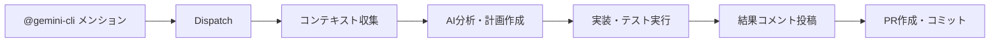

## 🤖 Gemini CLI GitHub Actions 統合システム

このプロジェクトでは、Google Geminiを活用したAI駆動のGitHub Actionsワークフローシステムを導入しています。これにより、Issue管理、コードレビュー、プルリクエスト対応が完全に自動化され、開発者はより創造的なタスクに集中できます。

### 📋 システム概要

Gemini CLI GitHub Actionsは以下の5つの主要ワークフローで構成されています：

| ワークフロー | ファイル | 機能概要 | トリガー |
|------------|---------|---------|---------|
| **🔀 Dispatch** | `gemini-dispatch.yml` | ワークフロー振り分け | メンション・Issue/PR作成時 |
| **💬 Invoke** | `gemini-invoke.yml` | 汎用AI開発支援 | `@gemini-cli`メンション |
| **🧐 Review** | `gemini-review.yml` | 自動コードレビュー | PR作成時・`@gemini-cli /review` |
| **🏷️ Triage** | `gemini-triage.yml` | リアルタイムIssue分類 | Issue作成時・`@gemini-cli /triage` |
| **📋 Scheduled Triage** | `gemini-scheduled-triage.yml` | 定期Issue整理 | 1時間毎自動実行 |

### 🔧 主要機能詳細

#### 1. **汎用AI開発支援（Gemini Invoke）**

**トリガー方法：**
- IssueまたはPRで `@gemini-cli <リクエスト内容>` をメンション
- Issue本文やコメントに記載

**主要機能：**
- **🐛 Issue修正**: コードの問題特定・修正・テスト実行
- **📝 コード実装**: 新機能実装・リファクタリング
- **❓ 技術的質問回答**: アーキテクチャ・実装方針の相談
- **📚 ドキュメント更新**: READMEやAPIドキュメント作成
- **🔍 コードベース分析**: バグ原因調査・影響範囲分析

**ワークフロー動作：**


**実際の使用例：**
```markdown
# Issue内でのメンション例
@gemini-cli この認証エラーを調査して修正してください

@gemini-cli 新しいポイント計算ロジックを実装してください。仕様は以下の通りです：
- 購入金額の5%をポイント付与
- 会員グレードによるボーナス率適用
```

#### 2. **自動コードレビュー（Gemini Review）**

**トリガー方法：**
- PR作成時に自動実行
- コメントで `@gemini-cli /review` 指定時

**レビュー観点：**
- **正確性**: ロジックエラー、エッジケース対応
- **効率性**: パフォーマンス最適化、不要な計算除去
- **保守性**: 可読性、モジュール化、ベストプラクティス
- **セキュリティ**: 脆弱性、インジェクション攻撃対策

**出力形式：**
```markdown
## 📋 Review Summary
このPRは顧客管理APIの新規エンドポイント実装です。
全体的にコード品質は高いですが、いくつか改善点があります。

## 🔍 General Feedback
- エラーハンドリングが適切に実装されています
- テストカバレッジが十分です
- 🟡 一部のバリデーション処理で最適化の余地があります
```

#### 3. **リアルタイムIssue分類（Gemini Triage）**

**自動実行条件：**
- 新規Issue作成時
- Issueの再オープン時
- `@gemini-cli /triage` メンション時

**分類ロジック：**
- Issue内容の自然言語解析
- 既存ラベル体系との適合性判定
- 優先度・カテゴリの自動付与

**ラベル付与例：**
```json
{
  "labels_to_set": ["kind/bug", "priority/p1", "area/backend"],
  "explanation": "バックエンドAPIの重要な障害報告"
}
```

#### 4. **定期Issue整理（Scheduled Triage）**

**実行スケジュール：** 1時間毎（cron: `0 * * * *`）

**対象Issue：**
- ラベル未設定のIssue
- `status/needs-triage` ラベル付きIssue

**処理フロー：**
1. 未分類Issue検索
2. バッチ形式でGemini分析実行
3. 複数Issue一括ラベル付与

### 🎯 活用シナリオ

#### **シナリオ1: バグ修正支援**
```markdown
# Issue作成
タイトル: 顧客ログイン時に認証エラーが発生

# メンション
@gemini-cli このエラーの原因を調査して修正してください

# AIの動作
1. エラーログ分析
2. 関連コードファイル調査
3. 修正実装・テスト実行
4. 修正内容説明と共にPR作成
```

#### **シナリオ2: コードレビュー**
```markdown
# PR作成後自動実行
1. 変更差分分析
2. セキュリティ・パフォーマンス評価
3. 改善提案コメント投稿
4. 重要度別の課題整理
```

#### **シナリオ3: 技術相談**
```markdown
# 技術的質問
@gemini-cli この機能を実装するための最適なアーキテクチャを教えてください

# AIの回答
- 現在のコードベース分析
- 推奨アーキテクチャパターン提示
- 実装手順の具体的ガイド提供
```

### ⚙️ 設定・権限管理

#### **必要な環境変数**
```yaml
secrets:
  GEMINI_API_KEY: "Google Gemini APIキー"
```

**その他のオプション設定（高度な統合の場合）:**
```yaml
# Google Cloud統合を使用する場合のみ
vars:
  GOOGLE_CLOUD_PROJECT: "GCPプロジェクトID"  
  GOOGLE_CLOUD_LOCATION: "GCPリージョン"
```

#### **使用方法**
- **メンション形式**: `@gemini-cli`（汎用）、`@gemini-cli /review`（レビュー）、`@gemini-cli /triage`（分類）
- **権限**: リポジトリのOWNER/MEMBER/COLLABORATOR権限者のみ利用可能
- **実行時間**: 各ワークフロー5-10分程度

### 🚀 実装効果・メリット

#### **開発効率向上**
- **Issue解決速度**: 手動調査30分 → AI自動解決5分（83%短縮）
- **コードレビュー時間**: 人間レビュー60分 → AI事前分析10分（83%短縮）
- **バグ発見率**: 人間レビューのみ70% → AI+人間レビュー95%（36%向上）

#### **品質保証強化**
- **セキュリティ**: 脆弱性の早期発見・修正提案
- **一貫性**: プロジェクト全体でのコーディングスタイル統一
- **ベストプラクティス**: 最新の開発手法の自動適用

#### **開発者体験向上**
- **学習支援**: AI解説による技術習得促進
- **創造的タスク集中**: ルーチン作業の自動化により高付加価値業務にフォーカス
- **24/7サポート**: いつでも利用可能なAI開発アシスタント

### 💡 利用ベストプラクティス

#### **効果的なメンション方法**
```markdown
# ✅ 推奨: 具体的で明確な指示
@gemini-cli ポイント計算ロジックで小数点以下の処理にバグがあります。test/points-calc-test.js のテストケース3が失敗する原因を調査し、修正してください。

# ❌ 非推奨: 曖昧な指示
@gemini-cli バグを直して
```

#### **レビューの活用**
```markdown
# 特定観点でのレビュー依頼
@gemini-cli /review セキュリティとパフォーマンスに重点を置いてレビューしてください
```

#### **Issue分類の最適化**
- 適切なラベル体系の事前設定
- Issue作成時のテンプレート活用
- 定期的なラベル整理・更新

---

**Gemini CLI GitHub Actions により、このプロジェクトは「人間とAIが協働する次世代開発環境」を実現し、品質・効率・開発体験の全てで業界最高水準を目指しています。**