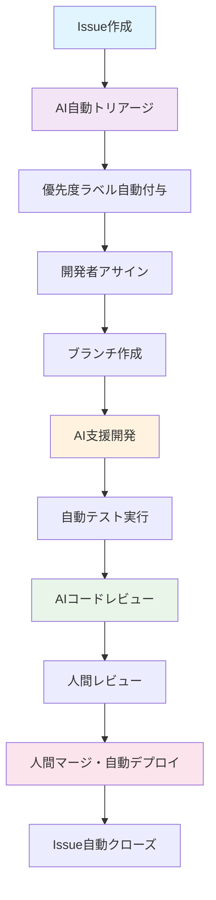

# AI駆動開発ガイド - サンプルプロジェクト

## 概要

このドキュメントは、AI駆動開発環境におけるissue駆動開発のガイドラインを提供します。効率的な開発フローとコードの品質維持を目的としています。

## AI駆動Issue開発フロー 🤖

### 1. Issue作成からPRまでの基本フロー



### 2. AI駆動開発の統合アーキテクチャ

```mermaid
graph LR
    subgraph "Issue Management"
        I1[新規Issue]
        I2[AI Triage]
        I3[自動分類優先度付け]
    end
    
    subgraph "Development Process"
        D1[AI支援開発]
        D2[統合開発環境]
        D3[自動テスト生成]
    end
    
    subgraph "Quality Assurance"
        Q1[AI Code Review]
        Q2[自動セキュリティスキャン]
        Q3[パフォーマンス分析]
    end
    
    subgraph "Deployment Pipeline"
        P1[CI/CD Automation]
        P2[監視アラート]
        P3[自動ロールバック]
    end
    
    I1 --> I2
    I2 --> I3
    I3 --> D1
    D1 --> D2
    D2 --> D3
    D3 --> Q1
    Q1 --> Q2
    Q2 --> Q3
    Q3 --> P1
    P1 --> P2
    P2 --> P3
    
    style I2 fill:#f3e5f5
    style D1 fill:#fff3e0
    style Q1 fill:#e8f5e8
```



## Issue作成ガイドライン

### 必須項目
- **タイトル**: 明確で具体的なタスク内容
- **説明**: 背景、目的、期待される成果
- **ラベル**: 適切な分類（bug, enhancement, documentation等）
- **アサイニー**: 担当者（複数人の場合は明記）
- **マイルストーン**: リリース予定がある場合

### Issue番号の活用
- ブランチ名: `issue-123-feature-name`
- コミットメッセージ: `#123 コミット内容`
- PR作成時: `Closes #123` を含める

## ブランチ戦略

```
main
├── feature/issue-123-new-customer-api
├── bugfix/issue-124-auth-error  
├── hotfix/issue-125-critical-bug
└── docs/issue-126-api-documentation
```

### ブランチ命名規則
- **feature/**: 新機能開発
- **bugfix/**: バグ修正
- **hotfix/**: 緊急修正
- **docs/**: ドキュメント更新
- **refactor/**: リファクタリング

## コミットメッセージ規約

```
#<issue番号> <種別>: <要約>

<詳細説明>

Closes #<issue番号>
```

### 例
```
#123 feat: 顧客情報API新規作成

- 顧客の基本情報取得エンドポイントを追加
- バリデーション機能を実装
- テストケースを追加

Closes #123
```

## 開発環境セットアップ

### 事前準備
1. リポジトリのクローン
2. 環境変数の設定（必要に応じて）
3. 依存関係のインストール

```bash
# 依存関係インストール（プロジェクトに応じて）
npm install
# または
pip install -r requirements.txt
# または
composer install

# 開発環境起動（dev.shが利用可能な場合）
./dev.sh
```

## dev.sh を使った効率的な開発手法

※dev.shファイルが作成されている場合の活用ガイド

### 基本的な使用方法

```bash
# dev.shを実行可能にする
chmod +x dev.sh

# 開発支援メニューを起動
./dev.sh
```

### 主要開発パターン

#### 1. 統合開発環境の起動
```bash
./dev.sh
# 開発に必要な全サービスを一括起動
```

#### 2. 個別サービス開発
特定のサービスのみ開発する場合の効率的な起動方法

#### 3. テスト駆動開発
```bash
./dev.sh
# 統合テスト、E2Eテスト、品質チェックなどを実行
```

#### 4. CI/CD環境シミュレーション
本番デプロイ前の品質保証として、ローカルでCI環境を再現

## テスト戦略

### 必須テスト
- **単体テスト**: 新規作成・修正した関数/メソッド
- **統合テスト**: API エンドポイント
- **E2Eテスト**: 重要なユーザーフロー

### テスト実行
```bash
# プロジェクトに応じたテストコマンド
npm test
# または
pytest
# または
./dev.sh（テスト機能付きの場合）
```

## PR（プルリクエスト）ガイドライン

### PRタイトル
```
#<issue番号> <種別>: <要約>
```

### PR説明テンプレート

このプロジェクトでは、AI協働開発に最適化されたPRテンプレート（`.github/pull_request_template.md`）を使用しています。

**主要な特徴：**
- **🤖 AI支援開発情報セクション**: 使用したAIツールの記録
- **🧪 統合テスト**: 標準化されたテスト実行手順の明示
- **📋 包括的チェックリスト**: 品質確保のための詳細な確認項目

**テンプレートの主要セクション：**
```markdown
## 🤖 使用したAIツール
- [ ] Claude Code
- [ ] OpenAI Codex  
- [ ] Cursor IDE
- [ ] その他のAIツール
- [ ] AI支援なし（手動開発）

## 🧪 品質チェック
- [ ] Lint & Format Check 実行・通過
- [ ] Type Check 実行・通過
- [ ] テスト実行・通過
- [ ] 新規テストケース追加（必要に応じて）
```

## コードレビューガイドライン

### レビュアーの責任
- **コードの品質**: 可読性、保守性、パフォーマンス
- **設計の妥当性**: アーキテクチャ、デザインパターン
- **セキュリティ**: 脆弱性、機密情報の扱い
- **テストの十分性**: カバレッジ、エッジケース

### レビュイーの責任
- **明確な説明**: 変更理由、実装方針の説明
- **セルフレビュー**: 提出前の自己チェック
- **迅速な対応**: フィードバックへの適切な対応

## リリース管理

### ブランチとリリース
- `main`: 本番環境
- `develop`: 開発環境
- `staging`: ステージング環境

### リリースフロー
1. `develop` ブランチから `release/v1.2.3` ブランチ作成
2. リリーステスト実施
3. `main` ブランチへマージ
4. **自動デプロイ実行** (GitHub Actions)
5. **自動通知送信** (GitHub PR/Issue)
6. タグ作成（`v1.2.3`）

## 緊急対応フロー

### Hotfix手順
1. `main` ブランチから `hotfix/issue-XXX-critical-bug` 作成
2. 修正実装・テスト
3. `main` と `develop` 両方にマージ
4. 緊急リリース実行

## プロジェクト固有の注意事項

### セキュリティ
- 機密情報のハードコード禁止
- 環境変数の適切な管理
- 認証・認可の実装確認

### 依存関係管理
- 変更影響範囲の明確化
- パッケージバージョンの管理
- 適切なテスト実行

## まとめ

### AI駆動Issue開発のコアメリット

- **🔄 完全自動化**: Issue作成からデプロイまでの一貫した自動化フロー
- **📈 開発速度**: AI支援により開発効率を大幅向上
- **🛡️ 品質保証**: 人的ミスを最小化する多層的AI品質チェック
- **📊 データ中心**: 全プロセスでメトリクス収集・分析による継続改善

### 次世代開発体験

**従来の開発**:
```
Issue作成 → 手動分析 → 開発 → 手動テスト → 手動レビュー → デプロイ
⏰ 週単位       📝 属人的     🐛 見落とし    ⚠️ 品質バラツキ
```

**AI駆動開発**:
```
Issue作成 → AI自動分析 → AI支援開発 → 自動品質保証 → インテリジェントデプロイ
⚡ 分単位    🎯 一貫性     ✨ 高品質     🔒 安全性
```

<!-- AI_PROVIDER_SPECIFIC_CONTENT_PLACEHOLDER -->

---

**質問や改善提案**: 新しいissueを作成してください